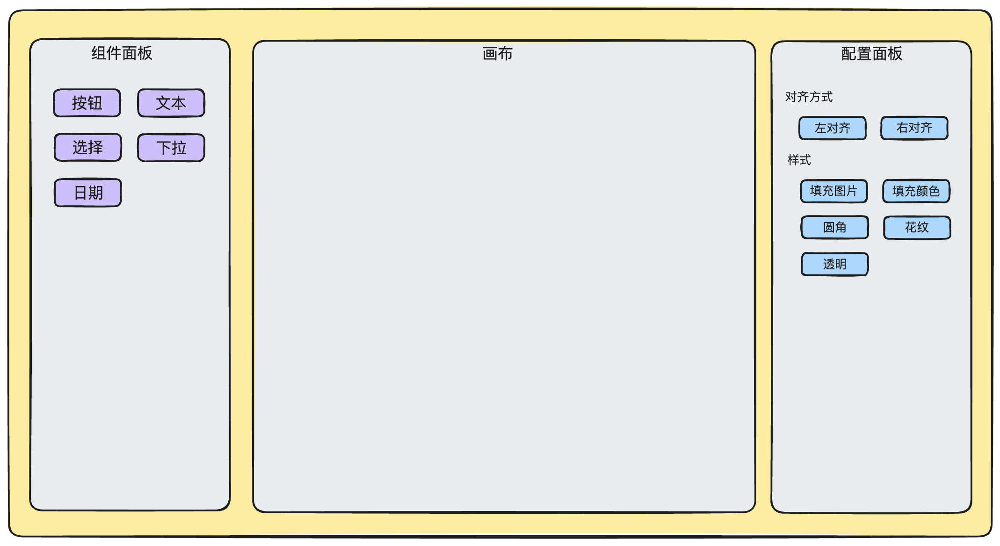
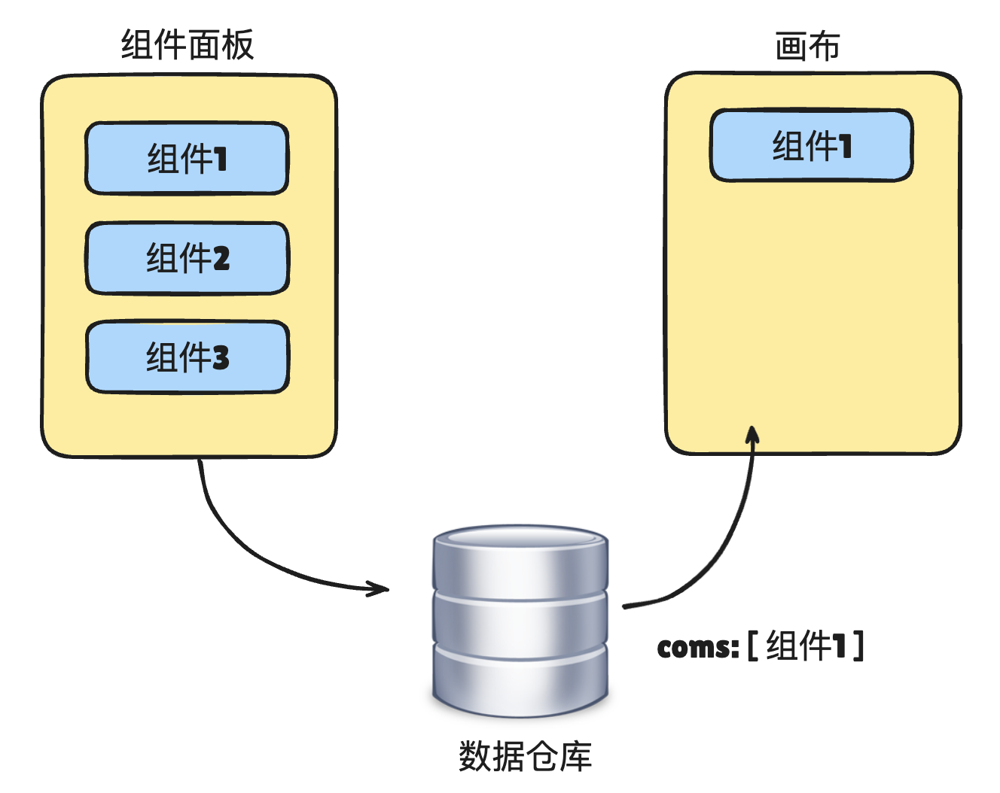

# 项目架构

## 编辑器大致结构

+ 组件面板
+ 画布
+ 配置面板

  

## 操作

+ 组件面板的组件添加至画布
+ 配置面板修改画布中的组件

## 组件面板的组件添加至画布

+ 画布渲染什么组件，完全取决于数据仓库里面有什么组件，包括之后的预览、生成在线问卷等功能，都是取决于数据仓库有是什么数据

  

## 配置面板修改画布中的组件

+ 每个业务组件会有一个 JSON 配置，该配置会记录该组件所有的配置信息，大致如下：

  ```js
  coms: [
    {
      name: 'com1',
      title: '单选题',
      fontSize: '16',
      isItalic: false,
      isBold: true,
      ...
    }
  ]
  ```

+ 这个 JSON 配置，称之为 JSON Schema. 用于描述业务组件的具体信息

## Schema

+ Schema 翻译成中文叫做“提要、纲要”，早期用于数据库领域，用于定义数据库、数据表、数据类型、格式、约束条件等一系列信息，从而确保数据的完整性和一致性

+ sql schema

  ```sql
  CREATE TABLE Books (
    BookID INT PRIMARY KEY AUTO_INCREMENT,
    Title VARCHAR(200) NOT NULL,
    Genre VARCHAR(50),
    PublishedYear INT,
    AuthorID INT,
    FOREIGN KEY (AuthorID) REFERENCES Authors(AuthorID)
  );
  ```

+ xml schema

  ```xml
  <xs:schema xmlns:xs="http://www.w3.org/2001/XMLSchema">
    <xs:element name="person">
      <xs:complexType>
        <xs:sequence>
          <xs:element name="name" type="xs:string"/>
          <xs:element name="age" type="xs:int"/>
        </xs:sequence>
      </xs:complexType>
    </xs:element>
  </xs:schema>
  ```

+ Protobuf Schema

  ```
  syntax = "proto3";
  message User {
    string name = 1;
    int32 age = 2;
  }
  ```

## 配置面板修改画布上组件的信息

+ 配置面板修改画布上组件的信息

  

+ 一个业务组件会对应多个编辑组件

  

## 技术栈

+ vue3
+ vue-router
+ pinia
+ element-plus
+ sass
+ dexie：基于 IndexedDB 的一个库
+ vite
+ typescript
+ eslint
+ prettier
+ fortawesome
+ vuedraggable
