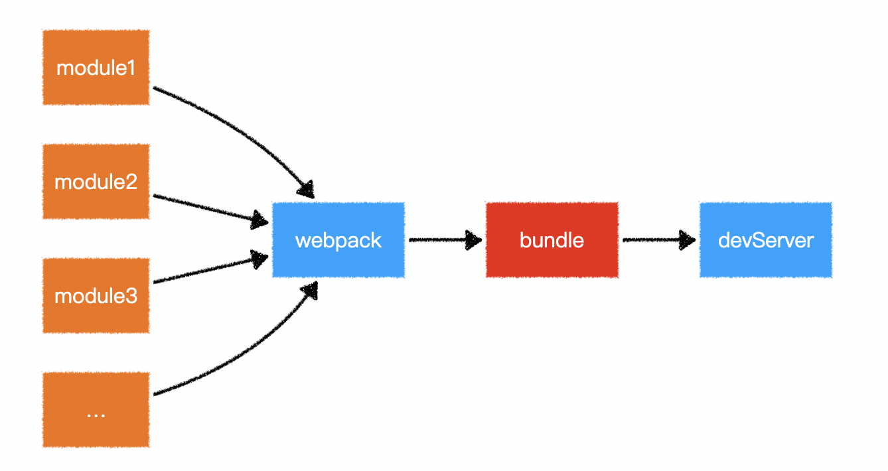
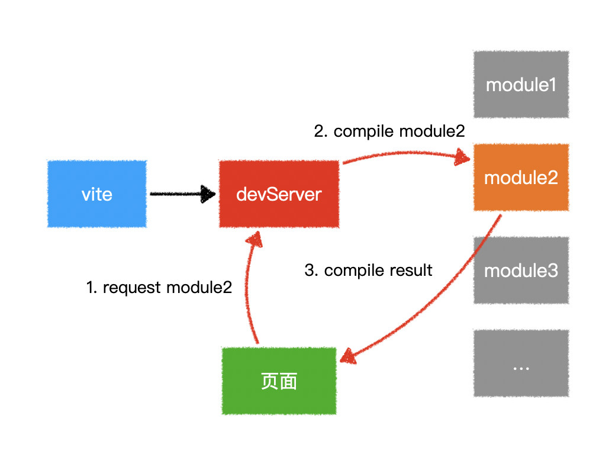

# vite基础

## webpack痛点

+ 在构建大型项目的时候，非常的慢

+ 因为在启动 webpack 项目的时候，webpack 会先对项目进行打包，然后运行的是打包后的文件

  

## Vite是如何解决的？

+ 完全跳过打包步骤，利用浏览器的 imports 机制，按需获取内容

  

+ 浏览器针对 .vue 这样的模块文件，需要做编译，编译为 JS 文件再返回给浏览器

  

+ 关于 Vite 中热更新的实现，底层实际上使用的是 websocket 来实现的

## 地址

+ vite <https://github.com/vitejs/vite>

## webpack 原理图

## vite 原理图

