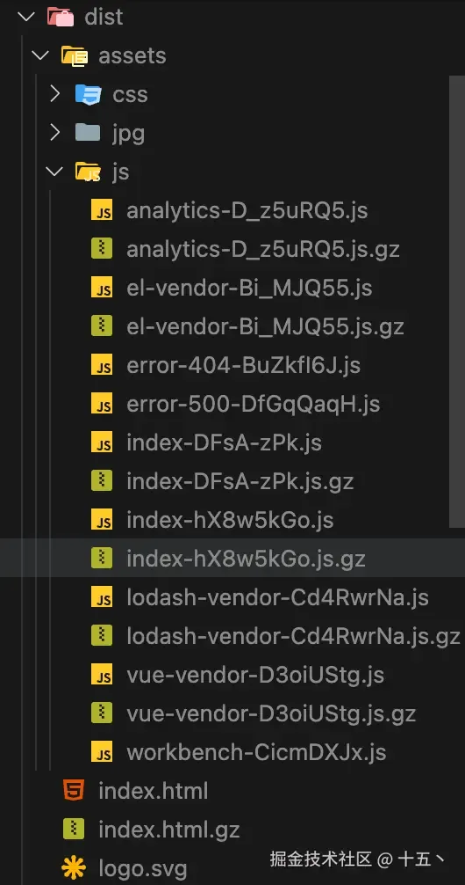

# 分包策略

## 什么是分包策略

+ 分包策略，就是根据不同的规则和逻辑来分割成大大小小的包，把一些固定，常规不更新的文件，进行分割切包处理

## 分包的作用

+ 分包是一种优化程序加载速度，性能的策略和操作

+ 试想一下，你有一个安装了多个依赖包的项目，当你进行打包时，这些代码都打包成了一个 js 文件，当你修改了其中的一些文件时要重新打包上线，浏览器会重新加载你的这个 js 文件，可是，你只修改了项目其中一部分，却要把整个文件都重新加载一边，是否合理呢？特别是当项目越来越大时，你就会发现页面的加载速度越来越慢

+ 所以，分包策略的作用在于：

+ 「减少代码体积和加载时间」: 当你的项目包含多个模块或者依赖项时，将它们分割成多个包可以减少单个包的体积。并且只重新加载修改的文件，减少加载时间
+ 「提高缓存利用率」:处理部分包而不是全部，分包可以提高浏览器的缓存命中率，从而减少不必要的网络请求，加快页面加载速度
+ 「优化资源结构」: 对于大型项目或者复杂的应用程序，通过合理划分功能模块和依赖项，有利于管理项目的整理结构和维护

## 分包策略的建议

+ 分包策略根据项目不同，会呈现出不同的策略，这里提供一些通用的思路

  + 按功能或模块分包
  + 按页面或路由分包
  + 按第三方依赖分包
  + 公共代码分包
  + 按环境分包

+ 项目体量越大，分包效果越明显

## 在 Vite 中的示例分包

+ 这一部分会需要一定的前端工程化及性能优化知识，参阅 Rollup

+ 在 Vite.config.ts 中的简单分包：

  ```js
  //vite.config.ts
  import type { UserConfig, ConfigEnv } from "vite";
  import vue from "@vitejs/plugin-vue";

  export default ({ mode }: ConfigEnv): UserConfig => {
    /**颗粒度更细的分包 */
    const manualChunks = (id: string) => {
      if (id.includes('node_modules')) {
        if (id.includes('lodash-es')) {
          return 'lodash-vendor';
        }
        if (id.includes('element-plus')) {
          return 'el-vendor';
        }
        if (id.includes('@vue') || id.includes('vue')) {
          return 'vue-vendor';
        }
        return 'vendor';
      }
    };

    return {
      plugins: [vue()],
      build: {
        chunkSizeWarningLimit: 1500, //超出 chunk 大小警告阈值，默认500kb
        //Rollup 打包配置
        rollupOptions: {
          output: {
            entryFileNames: "assets/js/[name]-[hash:8].js", //入口文件名称
            chunkFileNames: "assets/js/[name]-[hash:8].js", //引入文件名名称
            assetFileNames: "assets/[ext]/[name]-[hash:8][extname]", //静态资源名称
            manualChunks,
          },
        },
      },
    };
  };
  ```

+ id：依赖项详细信息

+ 一般来说，node_modules 中的第三方依赖项是不会去更改其源码的，我们只是使用而非修改，所以，可以通过配置 manualChunks 来将其分出去

+ 效果图：

  
