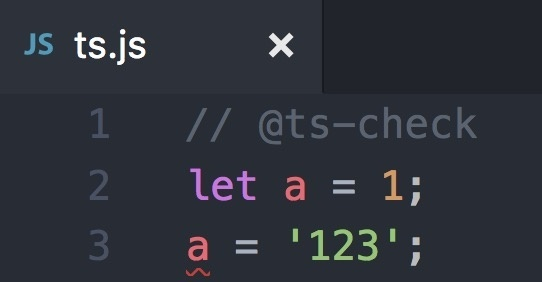

# 打开类型检查

## @ts-check

+ TypeScript 直接处理 JS 文件时，如果无法推断出类型，会使用 JS 脚本里面的 JSDoc 注释

+ 在 .js 文件的头部引入 `// @ts-check` 这样一行注释，就可以使用 TypeScript了

  ```js
  // @ts-check

  // ***代码
  ```

  

## @ts-check

+ 如果仅仅使用 `@ts-check` 的话，我们只能使用它的自动类型推断功能
+ 这对于大型项目来说是远远不够的，我们希望能像强类型语言一样指定每个变量的类型
+ 本着不对项目产生侵入的原则，TypeScript可以通过 JSDoc 风格的注释来完成这一点

## @ts-nocheck

+ `@ignore` 告诉JSDoc忽略这部分代码

  ```js
  /**
   * @ignore
   */
  var foo;
  ```

  ```js
  // @ts-nocheck
  ```

+ 跳过对某些文件的检查 (添加到该文件的首行才起作用)

  ```js
  // @ts-nocheck
  ```

## @ts-expect-error 有条件忽略

+ 预期并忽略下一行错误；如果没有错误，TS 会报错 Unused '@ts-expect-error' directive，强制你删掉注释，更安全

  ```js
  // @ts-expect-error
  const foo: string = 123; // 预期错误，忽略
  ```

+ 加注释说明原因

  ```js
  // @ts-expect-error: 第三方库 xyz 无类型定义，待后续补充
  import xyz from 'xyz';
  ```

+ 如果下一行真的有类型错误：正常编译、忽略错误
+ 如果下一行没有错误：编译失败，提示：

  ```js
  error TS2578: Unused '@ts-expect-error' directive
  ```

##
