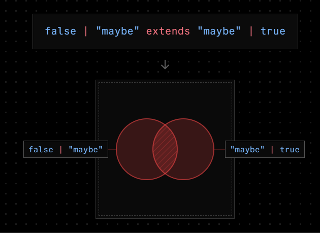

# 基础

## 概述

+ `A extends B` 表示 A 是 B 的子集

## 基本使用

+ `true extends boolean`

  

+ `boolean extends boolean`

  

+ `boolean extends true` **错误**

  

+ `false extends true` **错误**

  

+ `false | "maybe" extends "maybe" | true` **错误**

  

+ `"kit" extends string`

  

+ `never extends string`

  

+ `string extends any`

  
