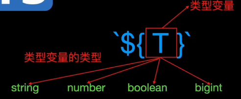

# 模板字面量类型

## 解决的问题

+ 控制字符串应该是什么样子

+ 是的，甚至字符串格式也可以是类型安全的。

+ 想象你的老师说：

  + “你只能按照这种格式写答案：数字 + 单位。”

+ 这意味着：

  + ✅ 10px

  + ✅ 2rem

  + ❌ 10

  + ❌ px

+ 模板字面量类型允许 TypeScript 强制执行这样的规则

## 语法

+ `${T}`

+ T的类型 `string` `number` `boolean` `bigint` `null` `undefined`

  

+ 这些类型在最终的字符串结果中都会被转换为字符串字面量类型，即使是 `null` 与 `undefined`

## 示例

+ 示例1

  ```ts
  type CSSUnit = "px" | "rem" | "em";
  type Size = `${number}${CSSUnit}`;

  function setWidth(size: Size) {
    console.log(size);
  }
  setWidth("20px");  // ✅ 合法
  setWidth("2rem");  // ✅ 合法
  setWidth("20");    // ❌ 错误
  setWidth("20pt");  // ❌ 不支持的单位
  ```

+ 示例2

  ```js
  type Greet<T extends string | number | boolean | null | undefined | bigint> = `Hello ${T}`;

  type Greet1 = Greet<"linbudu">; // "Hello linbudu"
  type Greet2 = Greet<599>; // "Hello 599"
  type Greet3 = Greet<true>; // "Hello true"
  type Greet4 = Greet<null>; // "Hello null"
  type Greet5 = Greet<undefined>; // "Hello undefined"
  type Greet6 = Greet<0x1fffffffffffff>; // "Hello 9007199254740991"
  ```

+ 示例3 API 接口

  ```ts
  type Method = "GET" | "POST";
  type Version = "v1" | "v2";
  type Resource = "users" | "posts";
  type ApiEndpoint = `${Method}/${Version}/${Resource}`;
  ```

  ```ts
  const endpoint: ApiEndpoint = "GET/v1/users"; // ✅ 合法
  const wrong: ApiEndpoint = "FETCH/v1/users";  // ❌ 不合法
  ```

## 使用场景

+ 设计系统

+ API 客户端

+ 路由生成器

+ 动态 class 名

+ 基于配置的 UI

