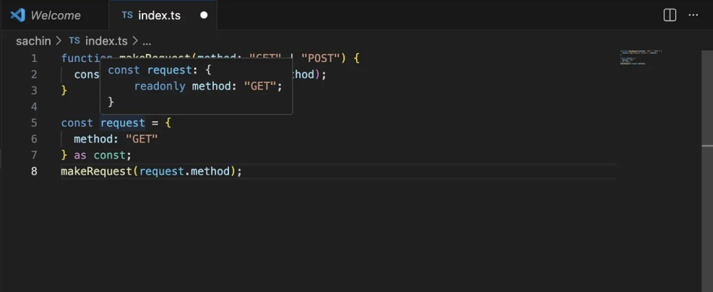
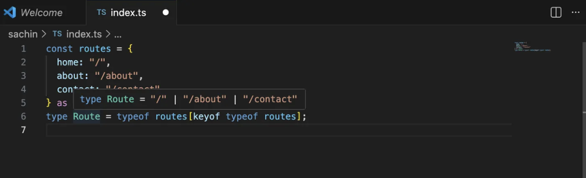

# as const 断言

## 概述

+ `as const` 断言，可以将代码中宽泛的数据类型定义具体话，从而避免我们在开发过程中，因为定义过于宽泛，造成的各种数据处理的错误，通过精准的数据类型定义，更好的管理我们前端代码

+ 注意：不是“强制转换”

## 语法

+ 语法1 `as const`

  ```js
  let y = [10, 'xgg'] as const;
  ```

+ 语法2 `<const>`

  ```js
  let y = <const>[10, 20];
  ```

## as const 实际上做了什么

1. 锁定值（只读）

  

2. 保留精确的字面量类型

3. 防止被扩宽为 string、number 等类型

  ```
  "GET" → 保持 "GET"
  42    → 保持 42
  true  → 保持 true
  ```

## 使用案例

+ 这在配置文件、路由或常量数据中非常有用

  ```js
  const routes = {
    home: "/",
    about: "/about",
    contact: "/contact"
  } as const;
  ```

+ 现在 TypeScript 会自动知道这些精确的值
+ 你甚至可以从中生成类型：

  ```js
  type Route = typeof routes[keyof typeof routes]; // "/" | "/about" | "/contact"
  ```

  

+ 不需要手动定义类型
+ 没有重复
+ 一切保持同步

## 使用场景

+ 在以下情况下使用 as const：

  + 定义配置对象时
  + API 方法常量
  + 路由
  + 状态码
  + action 类型（Redux 等）

+ 本质上就是：任何值不应该改变且必须保持精确的地方
