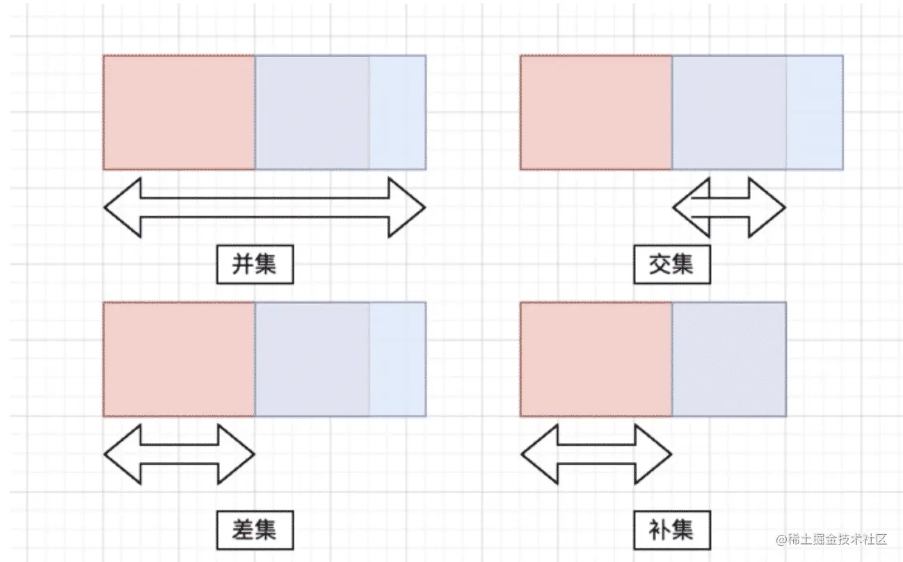

# 联合类型工具

## 概述

+ **并集** 两个集合的合并，合并时重复的元素只会保留一份（这也是联合类型的表现行为）
+ **交集** 两个集合的相交部分，即同时存在于这两个集合内的元素组成的集合
+ **差集** 对于 A、B 两个集合来说，A 相对于 B 的差集即为 A 中独有而 B 中不存在的元素 的组成的集合，或者说 A 中剔除了 B 中也存在的元素以后剩下的部分
+ **补集** 补集是差集的特殊情况，此时集合 B 为集合 A 的子集，在这种情况下 A 相对于 B 的补集 + B = 完整的集合 A

  

## Exclude 差集

+ Exclude<T, U> 差集

+ 从 T 中的删除可以赋值给 U 的类型

  ```js
  type A = number | string | boolean
  type B = number | boolean

  type Foo = Exclude<A, B>

  // 相当于
  type Foo = string
  ```

  ```js
  type SetA = 1 | 2 | 3 | 5;

  type SetB = 0 | 1 | 2 | 4;

  type AExcludeB = Exclude<SetA, SetB>; // 3 | 5
  type BExcludeA = Exclude<SetB, SetA>; // 0 | 4
  ```

+ 源码

  ```js
  type Exclude<T, U> = T extends U ? never : T;
  ```

## Extract 交集

+ Extract<T, U>

+ 提取 T 中可以赋值给 U 的类型

  ```js
  type T = string | number | boolean;
  type StringOnly = Extract<T, string>; // string
  type Numeric = Extract<T, number | bigint>; // number
  ```

  ```js
  type AExtractB = Extract<1 | 2 | 3, 1 | 2 | 4>; // 1 | 2
  ```

+ 源码

  ```js
  type Extract<T, U> = T extends U ? T : never;
  ```

## Complement 补集

+ 源码

  ```js
  export type Complement<A, B extends A> = Difference<A, B>;
  ```

## Concurrence 并集

+ 源码

  ```js
  export type Concurrence<A, B> = A | B;
  ```
