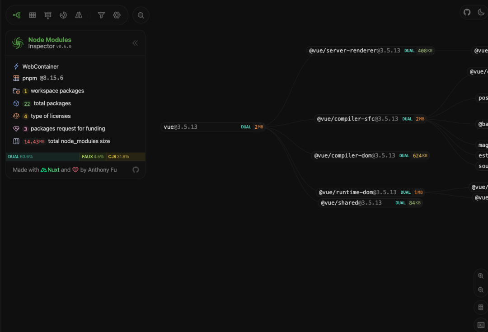
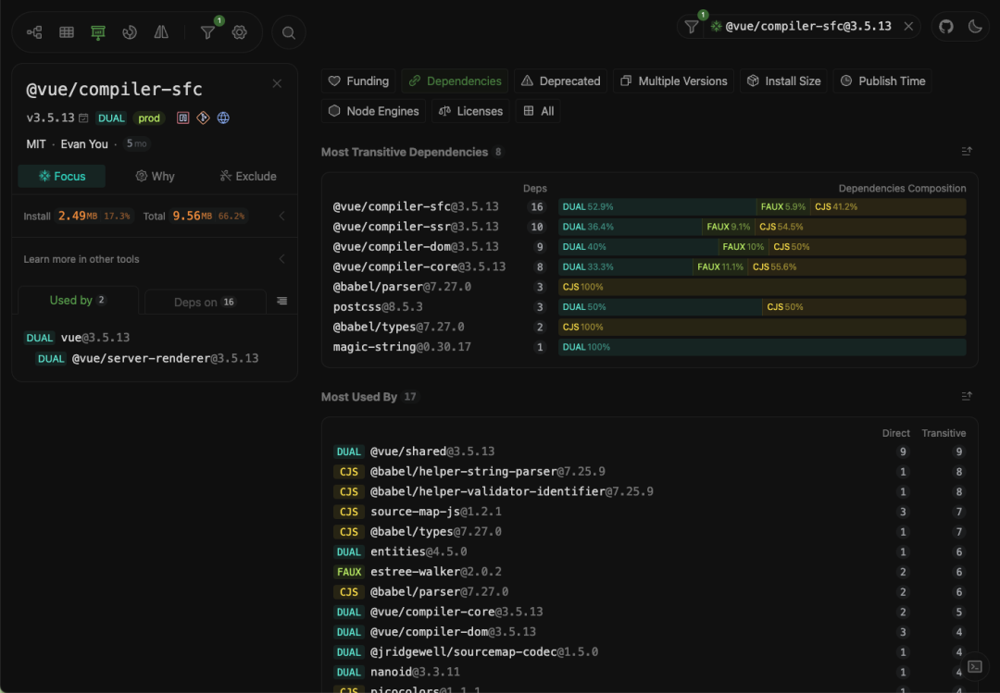
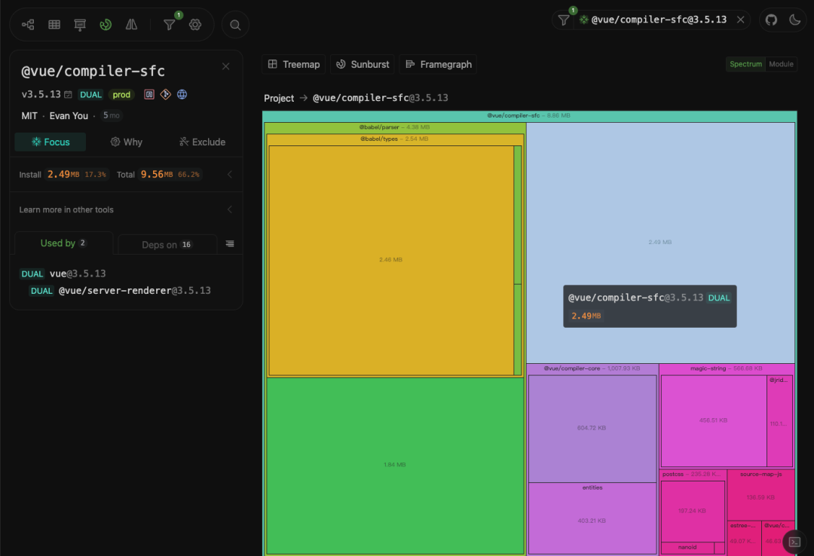

# Node Modules Inspector

## 概述

+ 专为前端开发者设计的可视化工具，它能够以图形化的方式呈现 node_modules 中的依赖关系

  

+ 无论是使用 pnpm 还是 npm 的项目，都可以轻松地通过这个工具来查看和分析项目的依赖结构

  + 直观的图形化界面：通过清晰的图表，你可以一目了然地看到各个依赖之间的关系，轻松定位冲突或冗余的依赖

    

  + 强大的分析能力：帮助开发者快速识别项目中的潜在问题，优化依赖结构，提升项目性能

    

  + 简单易用：无需复杂的配置，只需一条命令，即可启动可视化界面

    

## 在线体验

+ 如果你不想在本地安装工具，可以直接访问 Node Modules Inspector 的在线版本：https://node-modules.dev/

## 使用

+ 使用

  ```bash
  pnpx node-modules-inspector
  // or
  npx node-modules-inspector
  ```

+ 注

  + NPX：允许你直接运行 NPM 注册表上的任何 JavaScript 包，无需事先安装
  + pnpx：pnpm 的专属工具，用于获取包而不将其安装为依赖项，并运行其公开的命令

## 个性化配置

+ 为了满足不同项目的需求，你可以在项目根目录中创建一个配置文件 node-modules-inspector.config.ts，来自定义工具的行为

  ```js
  import { defineConfig } from 'node-modules-inspector'
  export default defineConfig({
    defaultFilters: {
      excludes: [
        'eslint', // 排除不需要显示的依赖
      ],
    },
    defaultSettings: {
      moduleTypeSimple: true, // 简化模块类型显示
    },
    publint: true, // 启用实验性的 publint 功能
  })
  ```

## 生成静态页面

+ 如果你希望生成一个静态的可视化页面，可以运行以下命令

  ```bash
  pnpx node-modules-inspector build
  npx node-modules-inspector build
  ```
