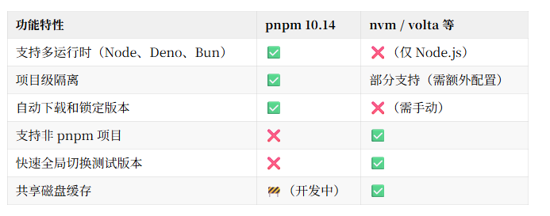

# 管理 Node.js

## 概述

+ 最近，pnpm 发布了 10.14 版本，带来了一个值得前端开发者关注的新功能：运行时自动安装

## 运行时安装支持

+ 过去我们在项目中使用不同版本的 Node.js，通常会依赖 nvm、volta、fnm 等工具来切换运行时环境
+ 而现在，pnpm 直接把这件事接管了，不用再单独装这些工具

+ 从 10.14 开始，只要你在项目中声明所需的运行时（比如 Node.js、Bun、Deno），pnpm 就能在执行时自动下载并使用对应版本
+ 说白了，它把原本属于 nvm 的那套逻辑，整合到了自己的工具链里

+ 更厉害的是，它不仅支持 Node.js，还原生支持 Bun 和 Deno

## 配置

+ 在项目的 package.json 中加上下面的配置就行了：

  ```json
  {
    "devEngines": {
      "runtime": {
        "name": "node",
        "version": "^24.1.0",
        "onFail": "download"
      }
    }
  }
  ```

  + name: 指定运行时，支持 node、deno、bun
  + version: 使用语义化版本号（semver），例如 ^24.1.0
  + onFail: 当前仅支持 "download"，就是在找不到对应运行时时会自动下载

## 亮点

+ 多运行时支持：不仅限于 Node.js，Bun 和 Deno 也能直接搞定，适合多种项目类型
+ 版本声明 + 自动锁定：支持语义化版本写法，解析出的具体版本会写入 pnpm-lock.yaml，保证环境一致
+ 无需预装运行时：pnpm 会在需要时自动拉取并配置，不用再手动装 node
+ 带校验的下载：每个运行时带有完整性校验，确保下载内容可信、可复现
+ 项目内隔离：每个项目有独立的运行时，不互相影响，特别适合 monorepo 或多项目并行开发

## pnpm 是怎么做到的

+ 版本解析：在 pnpm install 时解析 devEngines.runtime.version，选出符合条件的版本。
+ 写入锁文件：选中的版本、下载源、校验信息会写入 pnpm-lock.yaml。
+ 本地安装运行时：运行时被下载到项目本地目录，而不是全局环境，避免污染。
+ 自动绑定执行环境：你通过 pnpm run 执行命令时，它会自动使用项目中指定的运行时版本，完全无需手动切换 Node 环境

## 与 nvm 对比

+ 虽然 pnpm 的这个新功能确实很香，但像 nvm、volta、asdf 等工具还是有自己的用武之地

  


## 推荐使用 pnpm 的场景：

+ 已经在用 pnpm 管理依赖
+ 项目中混合使用 Node.js、Bun、Deno
+ CI/CD 环境中希望自动化安装和锁定运行时
+ 团队协作，重视开发环境的一致性

## 推荐继续保留 nvm / volta 的情况：

+ 经常在本地测试多个 Node.js 版本
+ 项目使用 npm、yarn 等其他工具链
+ 需要运行一些依赖全局环境的 CLI 工具或脚本

## 应用场景

+ 单项目开发：项目中定义了所需 Node.js 版本，其他人拉代码后直接运行，无需手动配置
+ Monorepo 多项目管理：每个子项目使用不同的运行时版本，互不干扰
+ CI/CD 部署：锁定运行时版本，构建环境一致性更高
+ 跨运行时测试：在一个工作区中并行测试 Node.js、Bun、Deno 的兼容性
