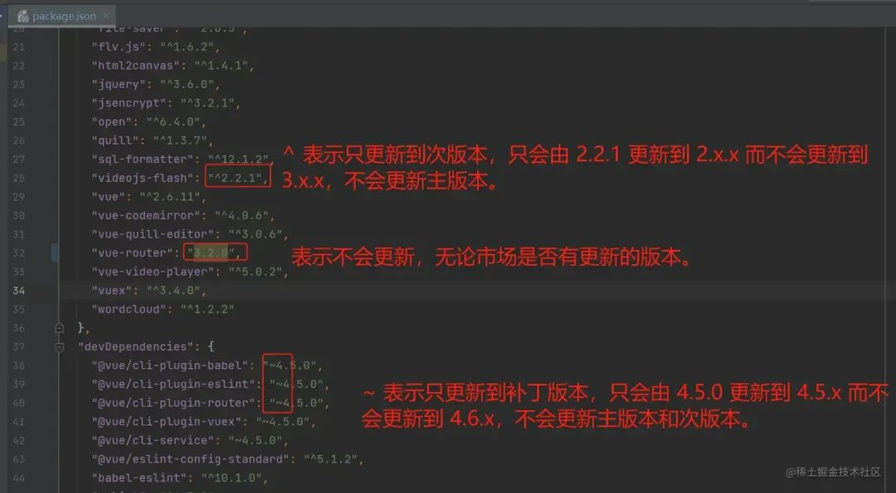

# package.json中的^~

## 概述

1. `^` 意思是要更新【次版本】，当市场有更新的版本时，例如：package.json 中是"^2.1.0"，库可能会更新到2.2.0的最新版本，但不会更新到3.0.0版本
2. `~` 意思是要更新【补丁版本】，当市场有更新的版本时，例如：package.json 中是"~2.1.0"，库可能会更新到2.1.1的最新版本，但不会更新到2.2.0版本
3. 版本号前面啥也没有，表示写死了版本号，无论何时何地安装的依赖版本只会是这个

  

## 版本锁定

+ 版本锁定

  ```json
  {
    "dependencies": {
      "vant": "2.13.4",  // 锁定具体版本
      "rspack": "1.1.8"
    }
  }
  ```

## 使用 package-lock.json

+ 确保团队使用相同的依赖版本
+ 防止自动升级到可能存在风险的版本

## 启用依赖审查

+ 启用依赖审查

  ```bash
  npm audit
  # 或
  yarn audit
  ```

## 采用 npm 安全最佳实践

+ 使用 npm ci 而不是 npm install

+ 定期更新依赖到安全版本

+ 使用 .npmrc 配置安全策略
