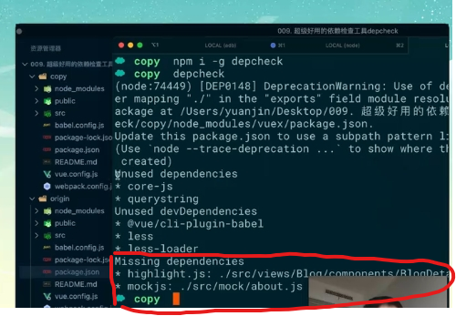
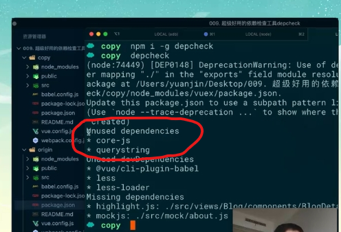

# depcheck

## 安装

+ 全局安装

  ```shell
  npm install -g depcheck
  ```

+ npx

  ```shell
  npx depcheck
  ```

+ 安装完成后提供的命令

  ```shell
  depcheck
  ```

## 需要解决的

+ missing dependencies 缺失的依赖。需要安装

  ```shell
  npm i xxx
  ```

  

+ Unused dependencies 安装未使用。可以删除

  

+ Unused devDependencies （检查不精准）

