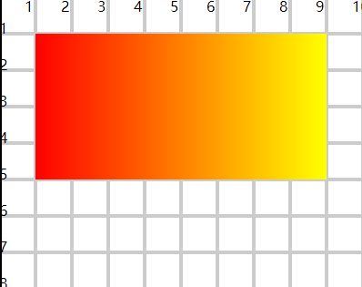
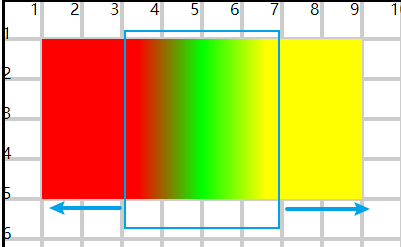

# 线性渐变

## 概述

+ 沿着执行进行颜色渐变（横向，纵向，斜向）

+ 使用 `<linearGradient>` 标记定义线性渐变

  + x1 y1 和 x2 y2 设置线条的两个端点。 按照线条方向渐变 （横向，纵向，斜向）
  + x y 位置用百分比设置，x是width的百分比 ， y是height的百分比
  + `<stop>` 设置每一阶段渐变的颜色和透明度

    + stop-opacity 透明度

  ```html
  <defs>
    <linearGradient id="gradient1"
                    x1="0%" y1="0%"
                    x2="100%" y2="0%">
      <stop offset="0%" stop-color="#f00" stop-opacity="1"/>
      <stop offset="100%" stop-color="#ff0" stop-opacity="1"/>
    </linearGradient>
  </defs>

  <rect x="10" y="10" width="80" height="40" fill="url(#gradient1)"/>
  ```

  

+ `<defs>` 不写，也可以实现渐变定义

+ 设置线性坐标点时，不一定非要从头到尾（0 or 100%) , 如果设置了中间数值，就在中间位置渐变
+ 两边就是起始和终止的颜色

  ```html
  <defs>
    <linearGradient id="gradient4"
                    x1="30%" y1="100%"
                    x2="70%" y2="100%" >
      <stop offset="0%" stop-color="#f00" stop-opacity="1"/>
      <stop offset="50%" stop-color="#0f0" stop-opacity="1"/>
      <stop offset="100%" stop-color="#ff0" stop-opacity="1"/>
    </linearGradient>
  </defs>

  <rect x="10" y="10" width="80" height="40" fill="url(#gradient4)"/>
  ```

  
