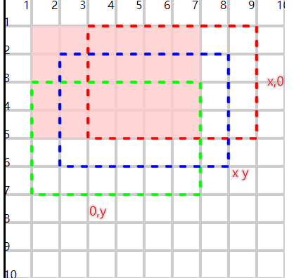

# 平移translate

## 概述

+ 没有指定y，默认为0

  ```html
  <rect x="10" y="10" width="60" height="40" fill="#fcc" fill-opacity="0.8"/>
  <rect x="10" y="10" width="60" height="40" fill="none" stroke="#f00" stroke-dasharray="2.5"
        transform="translate(20)"/>
  <rect x="10" y="10" width="60" height="40" fill="none" stroke="#0f0" stroke-dasharray="2.5"
        transform="translate(0,20)"/>
  <rect x="10" y="10" width="60" height="40" fill="none" stroke="#00f" stroke-dasharray="2.5"
        transform="translate(10,10)"/>
  ```

  
