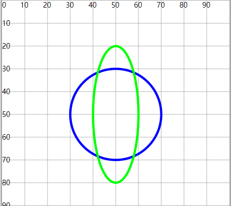

# 椭圆形

## 椭圆形ellipse

+ 标签

  + cx 和 cy 在坐标系设置原点
  + rx 和 ry 设置x轴半径和y轴半径

    + 圆形任意方向的半径相同
    + 椭圆形， 分为长轴半径和短轴半径

  ```html
  <ellipse cx="50" cy="50" rx="20" ry="20" fill="none" stroke="#00f" />
  <ellipse cx="50" cy="50" rx="20" ry="30" fill="none" stroke="#0f0" />
  ```

  
