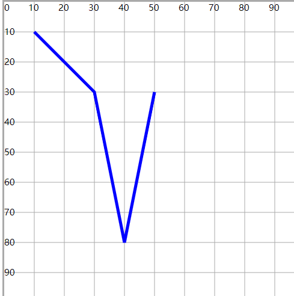

# 折线

## 折线 polyline

+ 多个点，一次绘制直线，最终形成一个折线效果

  + points 设置多个点的坐标值集合
  + 集合数值一定是偶数
  + 每一对表示一个点在坐标，每一个值可以使用【空格】或【逗号】隔开
  + 需要描边（`stroke`）才会显示折线效果
  + 除直线效果以外， 其实坐标和终止坐标之间会形成一个合围区域， 默认有填充颜色(可以设置 `fill="none"` 去除填充)

  ```html
  <polyline points="10 10,30 30,40 80,50 30" fill="none" stroke="#00f" stroke-width="1" />
  ```

  
