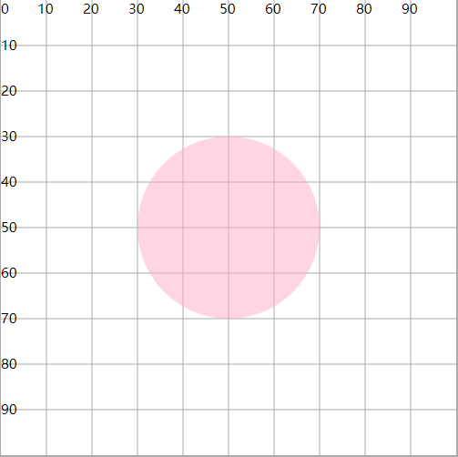
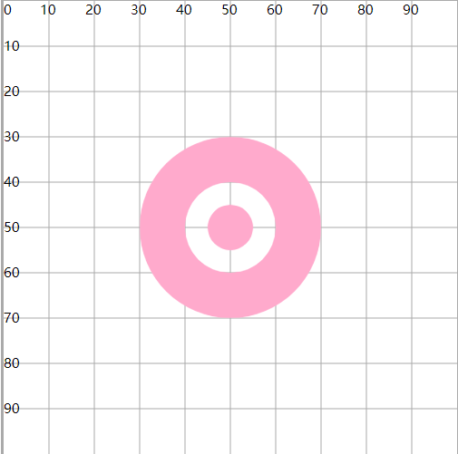
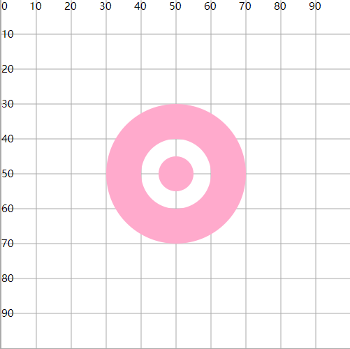

# fill 填充属性

## 概述

+ `fill` ：图形区域的颜色填充（背景颜色）
+ `fill-opacity` : 设置填充颜色的透明度

+ `fill-rule` ： 设置图形绘制过程中，重叠部分的所属规则(通过一些规则，确定重叠的区域是否属于当前图形，从而使得填充有效或失效)

  + `fill-rule="nonzero"` *默认值* 按照顺时针绘制图形时经过这片区域，计数器+1，逆时针绘制图形时经过这片区域，计数器-1，最终的结果为0，表示重叠区域不属于图形（fill失效）。结果非0，表示重叠区域属于图形（fill生效）
  + `fill-rule="evenodd"` 绘制过程中，经过一次区域，计数器+1. 最终的数量为奇数，表示在图形内，偶数表示在图形外

  ```html
  <circle cx="50" cy="50" r="20" fill="#fac" fill-opacity=".5"/>
  ```

  

## nonzero 属性

+ 一共绘制了三个圆，分别为圆30，圆40，圆45

  + 顺时针绘制圆30时，圆30区域+1=1，圆40区域+1=1 ， 圆45区域+1=1
  + 逆时针绘制圆40时，圆30区域=1 ， 圆40区域-1=0 ， 圆45区域-1=0
  + 顺时针绘制圆45时，圆30区域=1，圆40区域=0，圆45区域+1=1

+ 非0表示在图形内，fill生效； 0表示在图形外，fill失效

  ```html
  <path d="M30 50A20 20 0 0 1 70 50A20 20 0 0 1 30 50
         M40 50A10 10 0 0 0 60 50A10 10 0 0 0 40 50
         M45 50A5 5 0 0 0 55 50A5 5 0 0 0 45 50"
      fill="#fac"  fill-rule="nonzero" />
  ```

  

## evenodd 属性

+ 绘制圆30时， 圆30区域+1=1 ， 圆40区域+1=1 ， 圆45区域+1=1
+ 绘制圆40时，圆30区域=1 ， 圆40区域+1=2 ， 圆45区域+1=2
+ 绘制圆45时，圆30区域=1，圆40区域=2，圆45区域+1=3

+ 奇数表示在图形内，fill生效；偶数表示在图形外，fill失效

  
