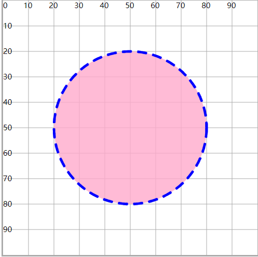

# CSS控制SVG

## 概述

+ css样式可以是行内样式，也是内嵌样式

  ```html
  <circle id="c1" style="" />
  ```

## 使用CSS设置SVG的效果属性 （fill ，stroke）

+ 主要就是对 `fill` 和 `stroke` 系列设置
+ 还允许对 `r` 、 `cx` 、 `cy` 、 `x` 、 `y` 属性进行设置
+ 有些属性css不支持，`d` 、 `points` 、 `x1` `y1` 、 `x2` `y2`

  ```html
  <style>
    #c1{
      cx:50;
      cy:50;
      r:30;
      fill:#fac;
      stroke:#00f;
      fill-opacity: 0.8;
      stroke-width: 1;
      stroke-dasharray: 4 2;
    }
  </style>

  <circle id="c1"/>
  ```

  

## 将CSS属性效果应用在SVG上

+ 绝大多数的css效果，都可以作用在svg上面（动画，渐变，效果）
+ 关于背景和边框，要使用SVG提供的属性 `fill` 和 `stroke` （ `background` 和 `border` 无效）
+ `after` 和 `before` 伪类样式也是不支持的

  ```html
  <style>
    #c1{
      fill:#fac;
      stroke: #00f ;
      stroke-width: 2;
      r:30;
      transition: 1s ;
    }

    #c1:hover{
      stroke: #0f0;
      fill:#afc;
      r:40;
    }
  </style>

  <circle id="c1" cx="50" cy="50"/>
  ```

## 内嵌样式

+ svg本身是一个xml语法，可以写在 `.svg` 文件中，也可以使用样式

  ```html
  <svg xmlns="http://www.w3.org/2000/svg" viewBox="0 0 100 100"
    width="500" height="500" style="border:#aaa solid" >
    <style>
      circle{
        fill:#fac;
        stroke:#00f;
      }
    </style>

    <circle cx="50" cy="50" r="30" style=""/>
  </svg>
  ```
