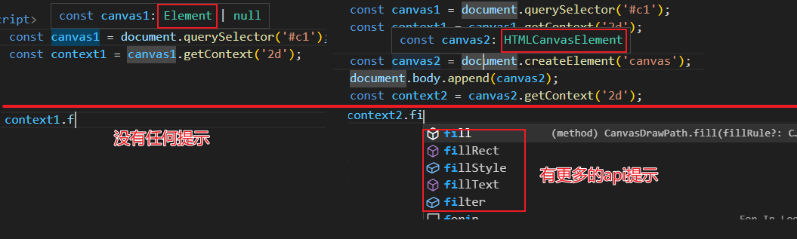

# 创建画布的方式

## 方式1 直接定义canvas标签

+ 直接定义canvas标签（对代码提示不友好，解决办法就是使用 JSDoc 添加类型）

  ```html
  <canvas></canvas>

  <script>
    /** @type {HTMLCanvasElement} */
    const canvas1 = document.querySelector("canvas"); // 获取画布

    /** @type {CanvasRenderingContext2D} */
    const ctr = canvas1.getContext("2d"); // 获取画笔
  </script>
  ```

## 方式2 利用js创建canvas标签

+ 利用js创建canvas标签（*推荐使用*），因为vscode有更友好代码提示

  ```js
  const canvas = document.createElement("canvas");
  document.body.append(canvas);
  ```

+ 使用js方式创建canvas时，canvas对象 和 context对象都是具体的类型(`HTMLCavansElement` , `CanvasRenderingContext2D` )，vscode编码开发时， 提示更加友好

  
