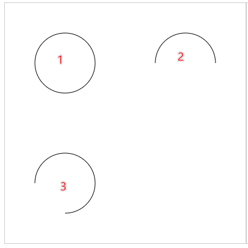
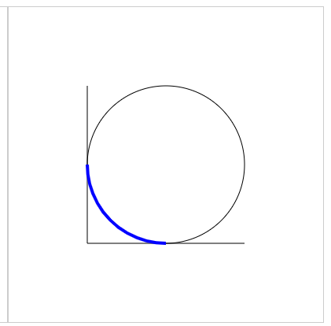

# 圆弧

## arc

+ `arc(x, y, r, startAngle, endAngle, [dir])`

  + x y 圆点坐标
  + r 半径
  + startAngle 起始绘制的角度，默认圆点x轴右侧半径位置为绘制的起始点(0度点,3点钟方向)，角度方向是*顺时针*
  + endAngle 结束点的角度
  + dir 绘制方向(`false` 顺时针*默认* ， `true` 逆时针方向)

+ 1(角度) = Math.PI / 180 (弧度)
+ 360(角度) = Math.PI * 2

  ```js
  // 360度
  ctx.beginPath();
  ctx.arc(100,100,50,0,Math.PI * 2) ;
  ctx.stroke();

  // 180度
  ctx.beginPath();
  ctx.arc(300,100,50,0,Math.PI,true);
  ctx.stroke();

  // 720度
  ctx.beginPath();
  ctx.arc(100,300,50,Math.PI/2,Math.PI,true);
  ctx.stroke();
  ```

  

## arcTo

+ `arcTo(x1, y1, x2, y2, r)`
+ 是由3个控制点实现圆弧的绘制

  + moveTo 或上一次图形结束的点， 为第一个点
  + x1 , y1 第二个点
  + x2 , y2 第三个点

+ 按照1，2，3顺序 进行连线，两条线会形成一个夹角
+ 根据r绘制圆弧，保证与两个线条相切

  ```js
  ctx.beginPath();
  ctx.moveTo(100,100);
  ctx.lineTo(100,300);
  ctx.lineTo(300,300);
  ctx.stroke();

  ctx.beginPath();
  ctx.lineWidth = 4;
  ctx.moveTo(100,200);
  ctx.arcTo(100,300,300,300,100);
  ctx.stroke()
  ```

  
