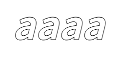

# 文本

## ctx.fillText 绘制填充文本

+ `ctx.fillText( textStr, x, y [, maxWidth] )`

  + textStr 文本内容
  + x , y 文本位置(坐标)
  + maxWidth (可选) 设置文本最大宽度

    + 如果文本宽度 > 最大宽度 就会放缩， 压缩在maxWidth范围内

  ```js
  ctx.fillText("绘制填充文本", 100, 100);
  ```

  

## ctx.strokeText 绘制描边文本（镂空）

+ `ctx.strokeText(textStr, x, y [, maxWidth])`

  

## measureText() 预测量文本宽度

+ 将返回一个 TextMetrics对象的宽度、所在像素，这些体现文本特性的属性
