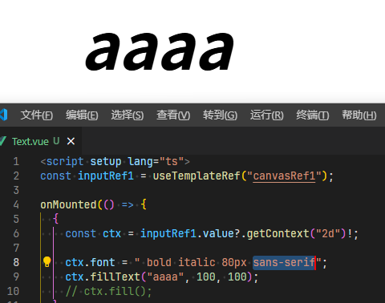

# 文本样式

## ctx.font 文本样式

+ 设置文本样式 （粗体 ， 斜体， 大小， 字体）
+ 必须设置字体， 否则其他样式无效

  ```js
  ctx.font = "bold italic 40px sans-serif";
  ctx.fillText("绘制填充文本", 100, 100);
  ```

  

## font = value

+ 当前我们用来绘制文本的样式
+ 这个字符串使用和 CSS font 属性相同的语法
+ 默认的字体是 10px sans-serif

## ctx.textAlign = value

+ 文本对齐选项
+ 可选的值包括：

  + start 默认值
  + end
  + left
  + right
  + center

  ```js
  ctx.textAlign = "center";
  ctx.font = " bold italic 80px sans-serif";
  ctx.strokeText("aaaa", 200, 200, 500);
  ```

## ctx.textBaseline = value

+ 基线对齐选项
+ 可选的值包括：

  + top 顶部
  + hanging
  + middle 中间
  + alphabetic 默认值
  + ideographic
  + bottom 底部

  ```js
  ctx.textAlign = "center";
  ctx.textBaseline = "middle";
  ctx.font = " bold italic 80px sans-serif";
  ctx.strokeText("aaaa", 200, 200, 500);
  ```

## direction = value

+ 文本方向

+ 可能的值包括

  + ltr
  + rtl
  + inherit 默认值
