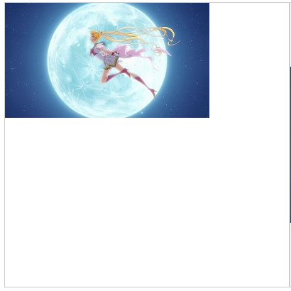
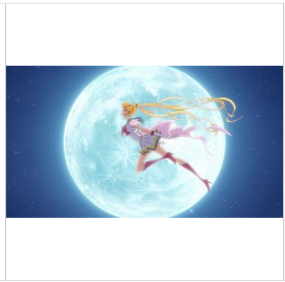
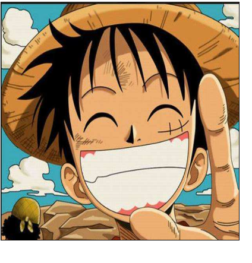

# drawImage

## 方式1 ctx.drawImage

+ `ctx.drawImage(imgSource, x, y)`

  + x , y 在canvas画布中放置的起始坐标位置

  + 会按照图像原大小展示

  ```js
  const img = new Image();
  img.src = "./路飞头像1.png"
  img.onload = () => {
    ctx.drawImage(img, 0, 0)
  }
  ```

  

## 方式2 ctx.drawImage

+ `ctx.drawImage(imgSource, x, y, width, height)`

  + `width` 和 `height` 图像展示的大小 （缩放处理，可能图片会变形）

  ```js
  const img = new Image();
  img.src = "./路飞头像1.png"
  img.onload = () => {
    ctx.drawImage(img, 0, 90, 400, 220);
  }
  ```

  

## 方式3 ctx.drawImage

+ `ctx.drawImage(imgSource, x1, y1, w1, h1, x2, y2, w2, h2)`

  + x1 y1 w1 h1 区域是图像的截图区域

    + 此时基于图像的坐标系

  + x2 y2 w2 h2 区域是画布展示区域

  ```js
  const img = new Image();
  img.src = "./路飞头像1.png"

  img.onload = () => {
    ctx.drawImage(img,28,200, 605,485, 0, 0, 400, img.height)
  }
  ```

  
