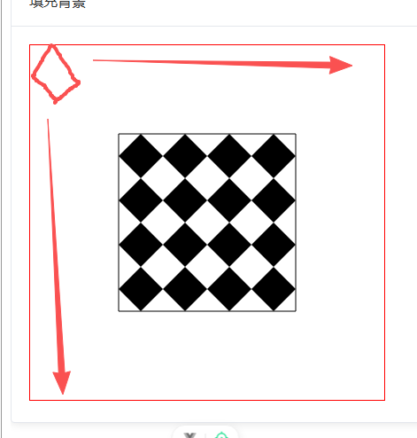
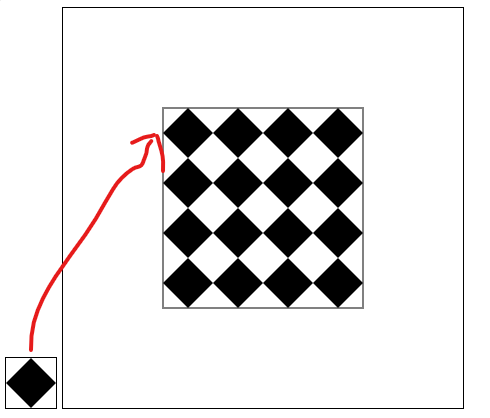

# 图像填充

## 使用场景

+ 填充背景
+ 描边背景

## 概述

+ 图像源可以有多种 ： `img` , `canvas` , `video` , . . .

## ctx.createPattern

+ 使用 `ctx.createPattern(imgSource, repetition)` 方法，创建一个图案对象（CanvasPattern）

  + 参数

    + imgSource 图像源

    + repetition 重复机制: `null` 值与空字符串（`""`）的处理方式相同：两者都是 `"repeat"` 的同义词

      + `repeat` *默认值* 两个方向都重复
      + `repeat-x` 仅水平方向重复
      + `repeat-y` 仅垂直方向重复
      + `no-repeat` 两个方向都不重复

  + 返回值

    + 如果 image 没有完全加载（即 HTMLImageElement.complete 是 false），则返回 `null`

+ 这个方法并不直接在画布上绘制任何内容

  + 必须赋值给 `ctx.fillStyle = pattern` 填充内容 或 `ctx.strokeStyle = pattern` 轮廓，之后才会应用于接下来的绘制操作

## 注意

+ 图案平铺的样式，都是基于画布坐标系的原点开始计算的

  

+ 所以在横向平铺，纵向平铺和不平铺的情况下，有可能画布中央的图形无法显示效果

## 示例

+ 从图像创建图案

  ```js
  const canvas = document.getElementById("canvas");
  const ctx = canvas.getContext("2d");

  const img = new Image();
  img.src = "canvas_createpattern.png";

  // 请确保在图像加载完成后再使用
  img.onload = () => {
    const pattern = ctx.createPattern(img, "repeat");
    ctx.fillStyle = pattern;
    ctx.fillRect(0, 0, 300, 300);
  };
  ```

+ 从画布创建图案

  ```html
  <canvas class="c1" width="50" height="50"></canvas>
  <canvas class="c2" width="400" height="400"></canvas>
  <script>
    const canvas1 = (function() {
      "use strict";

      /** @type {HTMLCanvasElement} */
      const canvas1 = document.querySelector(".c1");

      /** @type {CanvasRenderingContext2D} */
      const ctx = canvas1.getContext("2d");

      // 绘制一个菱形
      ctx.moveTo(0,25) ;
      ctx.lineTo(25,0);
      ctx.lineTo(50,25);
      ctx.lineTo(25,50);
      ctx.closePath();
      ctx.fill();
      return canvas1;
    })();

    const canvas2 = (function() {
      "use strict";

      /** @type {HTMLCanvasElement} */
      const canvas2 = document.querySelector(".c2");

      /** @type {CanvasRenderingContext2D} */
      const ctx = canvas2.getContext("2d");

      const pattern = ctx.createPattern(canvas1, null)
      ctx.fillStyle = pattern ;
      ctx.rect(100,100,200,200);
      ctx.stroke();
      ctx.fill();
    })();
  </script>
  ```

  
