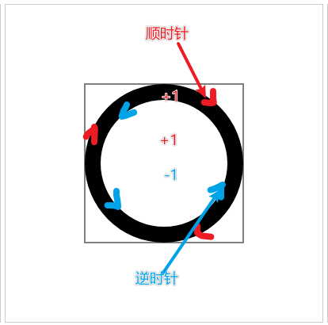
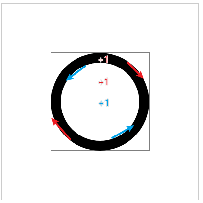
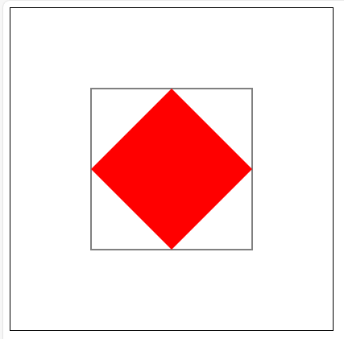
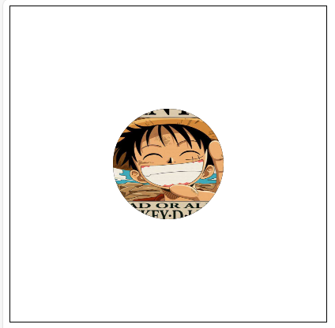
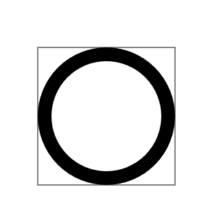

# 图像裁剪

## 概述

+ 使用 `ctx.clip()` 方法 设置裁剪路径， 接下来绘制的图形只会在裁剪路径中展示
+ 对之前绘制的图形没有影响

+ clip方法只表示裁剪，按照什么路径裁剪呢？

  + 按照 `clip()` 上面绘制的路径

## API

+ `ctx.clip()` 参数

  + `nonzero` : *默认值* 非零环绕路径（顺时针绘制经过路径区域，数量+1 ， 逆时针绘制经过路径，数量-1，路径区域最终经过的数量为0，就不裁剪(不可见））
  + `evenodd` : 奇偶环绕路径（不分顺时针和逆时针，只要绘制路径经过区域，就数量+1，最终奇数剪切，偶数不剪切）

  
  

+ 在绘制裁剪路径的时候，有些路径区域可能会被重复包含

## 示例

+ 矩形裁剪

  ```html
  <canvas class="c1" width="400" height="400"></canvas>

  <script>
  /** @type {HTMLCanvasElement} */
    const canvas1 = document.querySelector(".c1");

    /** @type {CanvasRenderingContext2D} */
    const ctx = canvas1.getContext("2d");
    ctx.beginPath();
    ctx.strokeRect(100,100,200,200)

    // 设置裁剪路径 开始
    ctx.beginPath();
    ctx.moveTo(100,200);
    ctx.lineTo(200,100);
    ctx.lineTo(300,200);
    ctx.lineTo(200,300);
    ctx.closePath();
    ctx.clip();
    // 设置裁剪路径 结束

    ctx.beginPath();
    ctx.fillStyle = "red";
    ctx.fillRect(100,100,200,200);
  </script>
  ```

  

+ 图片裁剪

  ```html
  <canvas class="c1" width="400" height="400"></canvas>

  <script>
  /** @type {HTMLCanvasElement} */
    const canvas1 = document.querySelector(".c1");

    /** @type {CanvasRenderingContext2D} */
    const ctx = canvas1.getContext("2d");

    const img = new Image();
    img.src = './路飞头像1.png';
    img.onload = () => {

      ctx.beginPath();
      ctx.arc(200, 200, 70, 0, Math.PI * 2);
      // ctx.fillStyle = "red";
      ctx.fill();

      ctx.clip();

      ctx.drawImage(img, 100, 100, 200, 200);
    }
  </script>
  ```

  

+ 参数

  ```html
  <canvas class="c1" width="400" height="400"></canvas>

  <script>
    /** @type {HTMLCanvasElement} */
    const canvas1 = document.querySelector(".c1");

    /** @type {CanvasRenderingContext2D} */
    const ctx = canvas1.getContext("2d");

    ctx.beginPath();
    ctx.strokeRect(100,100,200,200)

    ctx.beginPath();
    ctx.arc(200,200,100,0,Math.PI*2,false);// false为顺时针
    ctx.arc(200,200,80,0,Math.PI*2,true);// false为顺时针
    ctx.clip('nonzero');

    ctx.fillRect(100,100,200,200);
  </script>
  ```

  
