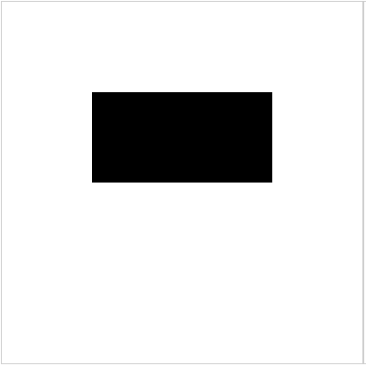
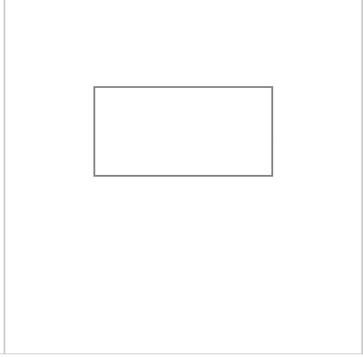

# 基础

## 概述

+ 可以绘制两种矩形， 有三种方式

+ 两种矩形

  + 填充的矩形(实心矩形)

    + ctx.fillRect

  + 描边的矩形(空心矩形)

    + ctx.strokeRect

## 方式1 ctx.fillRect 填充矩形

+ `ctx.fillRect(x, y, width ,height)`

  ```js
  const ctx = canvas.getContext('2d');
  ctx.fillRect(100,100,200,100);
  ```

  

## 方式2 ctx.strokeRect 描边矩形

+ `ctx.strokeRect(x, y, width , height)`

  ```js
  const ctx = canvas.getContext('2d');
  ctx.strokeRect(100,100,200,100);
  ```

  

## 方式3 ctx.rect 绘制矩形路径

+ `ctx.rect(x, y, width , height)`

+ 绘制矩形路径， 默认没有效果

+ 需要配合 `ctx.stroke()` , `ctx.fill()` 来描边或填充才会有效果

  ```js
  const ctx = canvas.getContext('2d');
  ctx.rect(100,100,200,100);

  ctx.stroke(); // 描边
  ctx.fill(); // 填充
  ```
