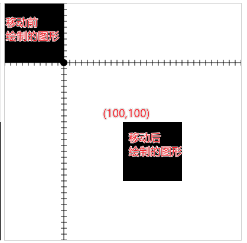

# 图像变换

## 概述

+ 就是对图形进行一个移动，旋转，放缩，矩阵斜切

## 1. 图形移动

+ 移动不是动画，只是视觉位置上的变化

+ 使用 `ctx.translate( x , y )` 方法实现图形位置的移动

  + 这里实际 *移动* 的并不是指定的图形，而是 *坐标系*
  + 对于之前已经绘制过的图形没有影响

  ```js
  /** @type {HTMLCanvasElement} */
  const canvas1 = document.querySelector(".c1");

  /** @type {CanvasRenderingContext2D} */
  const ctx = canvas1.getContext("2d");

  ctx.translate( 100 , 100 )
  ctx.rect(100,100,200,200);
  ctx.fill()
  ```

  
  

## 2. 图形放缩

+ 本质是对坐标系横纵坐标的放缩

+ 使用 `ctx.scale(xRatio , yRatio)` 方法设置横纵坐标的放缩比例

  + `0< ratio <1` 缩小
  + `1 < ratio` 放大
  + 负数 坐标系方向发生反

  ```js
  //坐标系很坐标放大2倍
  ctx.translate(200,200);
  ctx.scale(-2,1);

  //纵坐标系反转，构建数学坐标系
  ctx.translate(0,400);
  ctx.scale(1,-1);
  ```

  

## 3. 图形放缩

+ 使用 `ctx.rotate(angle)` 方法设置顺时针旋转的角度

  + 逻辑上传递的是角度，语法上要求传递是弧度

+ 移动与旋转的设置顺序不同，最终的效果也不相同

  ```js
  const canvas = document.createElement("canvas");
  canvas.width = 400;
  canvas.height = 400;
  document.body.append(canvas);

  const ctx = canvas.getContext("2d");

  ctx.strokeStyle = '#f00';
  ctx.setLineDash([10]);
  ctx.strokeRect(100,100,50,50);

  //变化坐标系
  ctx.translate(125,125);
  ctx.rotate(45 * Math.PI / 180) ;

  //坐标系中绘制图形
  ctx.fillRect(-25,-25,50,50);
  ```

  

## 4. 矩阵斜切

+ canvas没有提供斜切方法，可以利用矩阵变换来实现

+ 矩阵变换又可以实现所有的图形变换（平移，放缩，旋转，斜切）

### 矩阵变换机制

+ 所谓的变换就是将原坐标按照一定的变换公式(逻辑)，变换成一个新坐标

  + `( x , y )   ---  矩阵 --- (x' , y')`

+ 使用齐次坐标系来进行矩阵变换，可以简化平移计算

  ```txt
  |x|   |a c e|  |x'|
  |y| * |b d f| = |y'|
  |1|   |0 0 1|  |1 |

  x' = x*a + y*c + 1*e
  y' = x*b + y*d * 1*f
  1 =  x*0 + y*0 + 1*1
  ```

+ 使用 `ctx.transform(a , b , c , d , e , f)` 方法，传递转换矩阵，实现图形变换

### 矩阵移动

+ 就在原有x , y 的基础上， 移动指定的数值

  ```text
  1 0 e
  0 1 f
  ```
