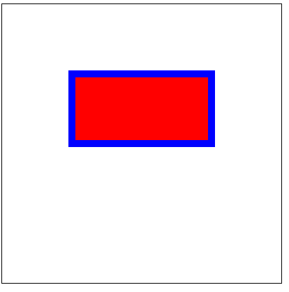

# 设置颜色 colors 与 描边宽度

## 设置颜色 colors

+ 给图形上色

+ 方法

  + `fillStyle = color` 设置图形的填充颜色

  + `strokeStyle = color` 设置图形轮廓的颜色

+ color 可以是表示 CSS 颜色值的字符串，渐变对象或者图案对象

## 设置颜色 注意点

+ *注意* 一定要在绘制图形之前设置

  ```js
  // 设置颜色 描边
  ctr.fillStyle = "red";
  ctr.strokeStyle = "blue";
  ctr.lineWidth = 10;

  ctr.rect(100,100,200,100);

  // 也可以在此设置描边

  ctr.fill();
  ctr.stroke();
  // 代码至此，已经绘制完毕
  ```

## fillStyle 设置图形的填充颜色

+ 设置图形的填充颜色

  ```js
  // 这些 fillStyle 的值均为 '橙色'

  ctx.fillStyle = "orange";
  ctx.fillStyle = "#FFA500";
  ctx.fillStyle = "rgb(255,165,0)";
  ctx.fillStyle = "rgba(255,165,0,1)";
  ```

## strokeStyle 设置图形轮廓的颜色

+ 设置图形轮廓的颜色

  ```js
  // 这些 fillStyle 的值均为 '橙色'

  ctx.strokeStyle = "orange";
  ctx.strokeStyle = "#FFA500";
  ctx.strokeStyle = "rgb(255,165,0)";
  ctx.strokeStyle = "rgba(255,165,0,1)";
  ```

## lineWidth 设置

+ 设置当前绘线的 *粗细*
+ 属性值必须为正数
+ 默认值是 1.0

  ```js
  ctx.lineWidth = 10; // 线条宽度
  ```

## 示例

+ 示例1

  ```js
  /** @type {HTMLCanvasElement} */
  const canvas1 = document.querySelector(".c1");

  /** @type {CanvasRenderingContext2D} */
  const ctr = canvas1.getContext("2d");

  ctr.fillStyle = "red";
  ctr.strokeStyle = "blue";
  ctr.lineWidth = 10;

  ctr.rect(100,100,200,100);
  ctr.fill();
  ctr.stroke();
  ```

  
