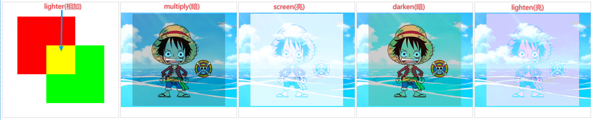

# 图像合成

## ctx.globalCompositeOperation

+ 将前后图形合成一个图形

+ 使用 `ctx.globalCompositeOperation` 属性设置合成机制

+ 需要在前后两个图形中间设置

  ```js
  /** @type {HTMLCanvasElement} */
  const canvas1 = document.querySelector(".c1");

  /** @type {CanvasRenderingContext2D} */
  const ctx = canvas1.getContext("2d");

  //前(原)图形
  ctx.beginPath();
  ctx.fillStyle = "red";
  ctx.fillRect(50,50,200,200);

  ctx.globalCompositeOperation = 'source-over'

  //后(新)图形
  ctx.beginPath();
  ctx.fillStyle = "blue";
  ctx.fillRect(150,150,200,200);
  ```

## 1. 路径(形状)合成

+ `source-over` : *默认* 前后图形都展示， 重叠部分展示后面的图形

+ `source-in` : 只展示后面的图形，展示与前面图形重叠的部分

+ `source-out`：只展示后面的图形，展示与前面图形不重叠的部分

+ `source-atop`: 展示前面的图形 和 后面的图形只展示与前面图形重叠的部分

  合成1.png)

+ `destination-` 系列(`over`,`in`,`out`,`atop`)上述合成特点， 前后图形交换

  + 以 `destination-over` 为例，前面的图形，覆盖在后面的图形上

  合成2.png)

+ `copy` 后面图形的覆盖前面的图形（前面的图形没了）

+ `xor` 展示前后两个图形非重叠的部分

  合成3.png)

  合成.png)

## 2. 颜色合成

+ 关注的是颜色的混合，图形的形状没有变化

+ `lighter` 重叠部分的颜色相加

+ `multiply` 整体偏暗

+ `screen` 整体偏亮

+ `darken` 同一个像素的颜色，取暗色，整体偏暗

+ `lighten` 同一个像素的颜色，去亮色，整体偏亮

  

  ```js
  /** @type {HTMLCanvasElement} */
  const canvas1 = document.querySelector(".c1");

  /** @type {CanvasRenderingContext2D} */
  const ctx = canvas1.getContext("2d");

  //前(原)图形
  const img1 = new Image();
  img1.src = "./01.png";
  img1.onload = () => {
    ctx.drawImage(img1, 200 - img1.width/2, 200 - img1.height/2);
    ctx.globalCompositeOperation = 'lighter'
  }

  //后(新)图形
  const img2 = new Image();
  img2.src = "./01.png";
  img2.onload = () => {
    ctx.drawImage(img2, 200 - img2.width/2, 200 - img2.height/2);
  }
  ```
