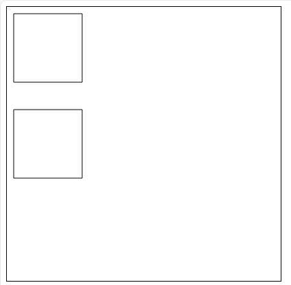
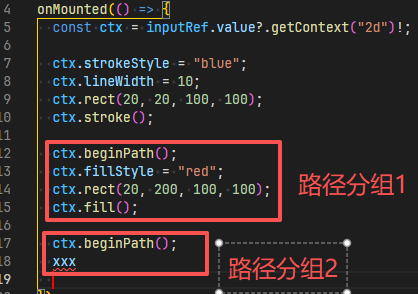

# 路径分组 beginPath

## 不使用 beginPath`

+ `stroke()` 或 `fill()` 默认会对之前所有绘制的路径进行一个处理
+ 如果不使用 `beginPath` 会导致相互影响

  ```js
  /** @type {HTMLCanvasElement} */
  const canvas1 = document.querySelector(".c1");

  /** @type {CanvasRenderingContext2D} */
  const ctr = canvas1.getContext("2d");

  ctr.rect(10, 10, 100, 100); // 自身没有描边，但是因为下面设置了导致也会出现描边

  ctr.rect(10, 150, 100, 100);
  ctr.stroke(); // 描边
  ```

  

## beginPath

+ 当我们需要只对刚刚绘制的图形**路径**进行处理时，和颜色属性无关

+ 这两者是一样的

  ```js
  ctx.beginPath();
  ctx.strokeStyle = "blue";
  ctx.lineWidth = 10;
  ctx.rect(20, 20, 100, 100);

  // or

  ctx.strokeStyle = "blue";
  ctx.lineWidth = 10;
  ctx.beginPath();
  ctx.rect(20, 20, 100, 100);
  ```

+ 就可以使用 `ctx.beginPath()` 方法，为不同部分的*路径*设置开关(设置分组)

+ 上一个 beginPath 与 下一个 beginPath 之间就是一组

  

+ 此时就只对紧邻这组*路径*进行绘制

  ```js
  ctx.beginPath();
  ctx.strokeStyle = "blue";
  ctx.lineWidth = 10;
  ctx.rect(20, 20, 100, 100);
  ctx.stroke();

  ctx.beginPath();
  ctx.fillStyle = "red";
  ctx.rect(20, 200, 100, 100);
  ctx.fill();
  ```
