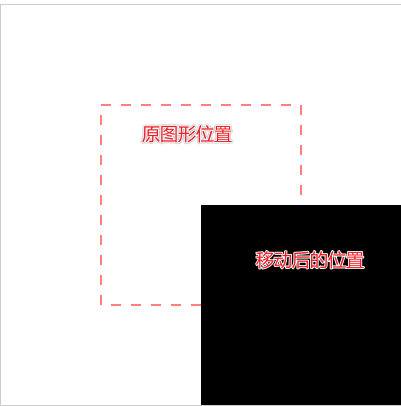
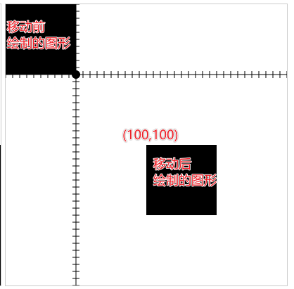
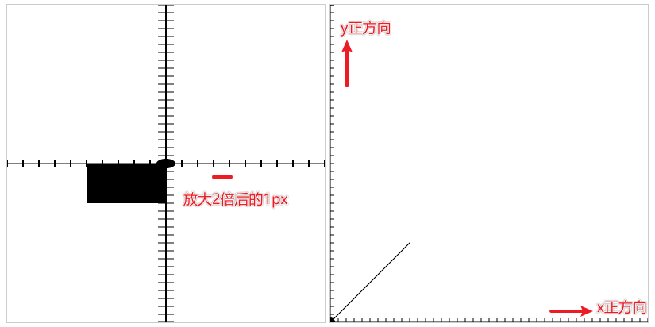
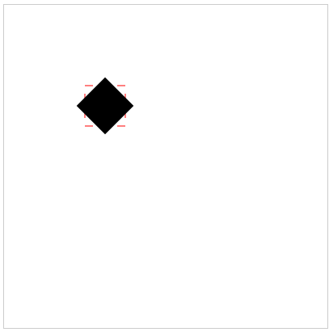

# 图像变换

## 概述

+ 就是对图形进行一个移动、旋转、放缩、矩阵斜切

## 1. 图形移动 translate

+ 移动不是动画，只是视觉位置上的变化

+ 使用 `ctx.translate(x, y)` 方法实现图形位置的移动

  + 参数

    + x 在水平方向上移动的距离。正值向右移动，负值向左移动
    + y 在垂直方向上移动的距离。正值向下移动，负值向上移动

+ 这里实际 *移动* 的并不是指定的图形，而是 *坐标系*
+ 对于之前已经绘制过的图形没有影响

  ```js
  /** @type {HTMLCanvasElement} */
  const canvas1 = document.querySelector(".c1");

  /** @type {CanvasRenderingContext2D} */
  const ctx = canvas1.getContext("2d");

  ctx.translate( 100 , 100 )
  ctx.rect(100,100,200,200);
  ctx.fill()
  ```

  
  

## 2. 图形缩放 scale

+ 本质是对坐标系横纵坐标的放缩

+ 使用 `ctx.scale(x , y)` 方法设置横纵坐标的放缩比例

  + 参数

    + x 水平方向的缩放因子。负值会将像素沿垂直轴翻转。值为 1 表示没有水平缩放

      + `0 < ratio < 1` 缩小
      + `1 < ratio` 放大
      + 负数 坐标系方向发生反

    + y 垂直方向的缩放因子。负值会将像素沿水平轴翻转。值为 1 表示没有垂直缩放

  ```js
  //坐标系很坐标放大2倍
  ctx.translate(200,200);
  ctx.scale(-2,1);

  //纵坐标系反转，构建数学坐标系
  ctx.translate(0,400);
  ctx.scale(1,-1);
  ```

  

## 3. 图形旋转 rotate

+ 使用 `ctx.rotate(angle)` 方法设置顺时针旋转的角度

  + 逻辑上传递的是角度，语法上要求传递是弧度

+ `rotate(angle)`

  + 参数

    + angle 顺时针旋转的弧度

      + 如果你想通过角度值计算，可以使用公式： `degree * Math.PI / 180`

      

+ 旋转中心点一直是 canvas 的原点

  + 如果想改变中心点，你可以通过 translate() 方法移动画布

+ 移动与旋转的设置顺序不同，最终的效果也不相同

  ```js
  const canvas = document.createElement("canvas");
  canvas.width = 400;
  canvas.height = 400;
  document.body.append(canvas);

  const ctx = canvas.getContext("2d");

  ctx.strokeStyle = '#f00';
  ctx.setLineDash([10]);
  ctx.strokeRect(100,100,50,50);

  // 变化坐标系
  ctx.translate(125,125);
  ctx.rotate(45 * Math.PI / 180) ;

  //坐标系中绘制图形
  ctx.fillRect(-25,-25,50,50);
  ```

  
