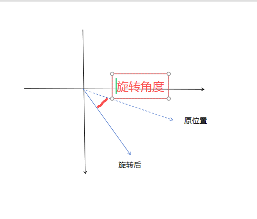
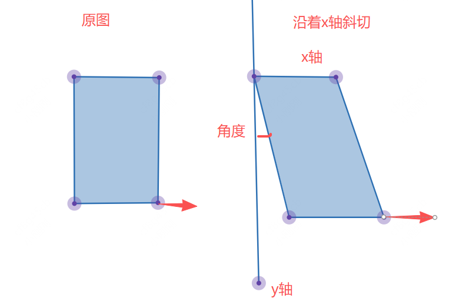

# 矩阵移动、缩放

## 矩阵移动

+ 就在原有x , y 的基础上， 移动指定的数值

  ```text
  1 0 e
  0 1 f
  ```

  ```js
  // x 轴移动 100

  1 0 100
  0 1 0

  ctx.transform(1,0,0,1,100,0)
  ```

  ```js
  // y 轴移动 100

  1 0 0
  0 1 100

  ctx.transform(1,0,0,1,0,100)
  ```

  ```js
  // x轴 与 y轴同时移动 100

  1 0 100
  0 1 100

  ctx.transform(1,0,0,1,100,100)
  ```

## 矩阵缩放

+ 矩阵缩放

  ```js
  // a 影响 x 轴的缩放
  // d 影响 y 轴的缩放
  a 0 0
  0 d 0
  ```

  ```js
  // x轴放大2倍，y轴缩小0.5倍

  2 0 0
  0 0.5 0

  ctx.transform(2,0,0,0.5,0,0)
  ```

## 矩阵旋转

+ 旋转也会发生角度的变化
+ 旋转都是基于x轴的正方向，顺时针旋转

  

+ 旋转角度是基于原位置的旋转角度，而不是基于x轴的旋转角度，所以还要考虑原位置与x轴夹角

  ```js
  cos(angle) -sin(angle) 0
  sin(angle) -cos(angle) 0
  ```

  ```js
  // 旋转45°

  ctx.transform(
    Math.cos(45 * Math.PI / 180),
    Math.sin(45 * Math.PI / 180),
    -Math.sin(45 * Math.PI / 180),
    -Math.cos(45 * Math.PI / 180),
    0,
    0
  )
  ```

## 矩阵斜切

+ 沿 x 或 y 轴做一个拉扯，使得 x或y 形成一个夹角

  ```
  1            tan(angle)    0
  tan(angle)   1             0
  ```

  + 沿 x轴斜切，会产生与 y轴的夹角 `skewX(30°)`

    ```
    // 斜切 30°
    1  Math.tan(30 * Math.PI / 180)    0
    0   1                        0

    ctx.transform(1, 0, Math.tan(30 * Math.PI/180), 1, 0, 0);
    ```

    

  + 沿 y轴斜切，会产生与 x轴的夹角
