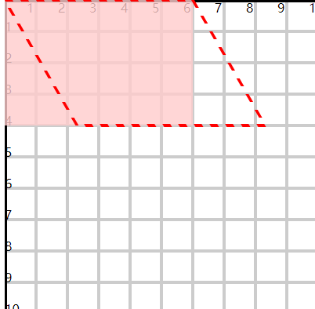
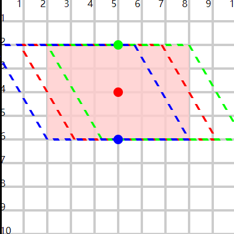

# 斜切

## 概述

+ 有两个函数 skewX 和 skewY

  + skewX 延x轴方向拉拽，最终与y轴形成指定的夹角
  + 默认是基于0 0点的一个斜切。 可以重新设置中间点

  ```html
  <rect x="0" y="0" width="60" height="40" fill="#fcc" fill-opacity="0.8"/>
  <rect x="0" y="0" width="60" height="40" fill="none" stroke="#f00" stroke-dasharray="2.5"
      transform="skewX(30)"/>
  ```

  

+ 中心点在某一个边上，倾斜时该边不动。其余3边有变化
+ 中心点在图形中，倾斜时4个边都有变化

  ```html
  <rect x="20" y="20" width="60" height="40" fill="#fcc" fill-opacity="0.8"/>
  <rect x="20" y="20" width="60" height="40" fill="none" stroke="#f00"
        stroke-dasharray="2.5" transform="skewX(30)" transform-origin="50 40"/>
  <rect x="20" y="20" width="60" height="40" fill="none" stroke="#0f0"
        stroke-dasharray="2.5" transform="skewX(30)" transform-origin="50 20"/>
  <rect x="20" y="20" width="60" height="40" fill="none" stroke="#00f"
        stroke-dasharray="2.5" transform="skewX(30)" transform-origin="50 60"/>

  <circle cx="50" cy="40" r="2" fill="#f00"/>
  <circle cx="50" cy="20" r="2" fill="#0f0"/>
  <circle cx="50" cy="60" r="2" fill="#00f"/>
  ```

  
