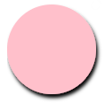
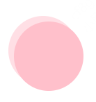

# shadow 阴影滤镜

## 概述

+ 使用 `<feDropShadow>` 标签

  + 它只能在 `<filter>` 元素内使用

  ```html
  <filter id="f1">
    <feDropShadow dx="0.2" dy="0.4" stdDeviation="0.2" />
  </filter>
  ```

## 属性

+ dx

  + 此属性定义了投影的 x 轴偏移量
  + 值类型：number 默认值：2；
  + 可用于动画

+ dy

  + 此属性定义了投影的 y 轴偏移量
  + 值类型：number 默认值：2；
  + 可用于动画

+ stdDeviation

  + 模糊值
  + 值类型：number 默认值：2；
  + 可用于动画

+ flood-color

  + 阴影的颜色

+ flood-opacity

  + 透明度

## 示例

+ 示例1

  ```html
  <svg width="400" height="400" view-box="0 0 100 100">
    <defs>
      <filter id="f1">
        <feDropShadow dx="2" dy="4" stdDeviation="2" />
      </filter>
    </defs>

    <circle cx="50" cy="50%" r="50" style="fill: pink; filter: url(#f1)" />
  </svg>
  ```

  

+ 示例2

  ```html
  <svg width="400" height="400" view-box="0 0 100 100">
    <defs>
      <filter id="f2">
        <feDropShadow dx="-8" dy="-8" stdDeviation="0" flood-color="pink" flood-opacity="0.5" />
      </filter>
    </defs>
    <circle cx="60" cy="50%" r="50" style="fill: pink; filter: url(#f2)" />
  </svg>
  ```

  
