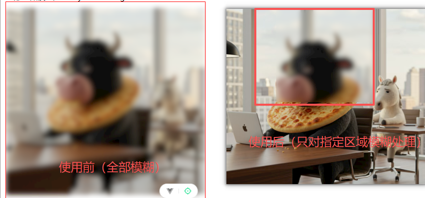
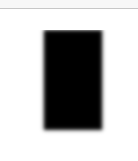
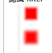

# blur 模糊滤镜

## 概述

+ 标签 `<feGaussianBlur>`

## 属性

+ in 设置输入源（对谁模糊）

  + 取值

    + BackgroundAlpha
    + BackgroundImage
    + fillPaint 填充颜色做处理
    + SourceAlpha 对作用图像的透明度实现模糊（黑色效果）
    + SourceGraphic 对作用的图像模糊
    + SourcePaint 描边颜色做模糊处理

  + 没有指定 in

    + 情况1 滤镜在最开始，此时默认针对的就是作用的图像
    + 情况2 滤镜在中间，对上一个滤镜效果做模糊处理

+ stdDeviation

  + 设置模糊程度

+ edgeMode

## 指定区域模糊处理

+ `x` `y` `width` `height` 设置模糊区域

  ```html
  <svg width="400" height="400" view-box="0 0 100 100">
    <defs>
      <filter id="f3">
        <feGaussianBlur
          in="SourceGraphic"
          stdDeviation="5"
          x="100"
          y="0"
          width="200"
          height="200"
          result="r3"
        />

        <feMerge>
          <feMergeNode in="SourceGraphic"></feMergeNode>
          <feMergeNode in="r3"></feMergeNode>
        </feMerge>
      </filter>
    </defs>

    <image xlink:href="./牛马.png" x="0" y="0" height="400" width="400" filter="url(#f3)"></image>
  </svg>
  ```

  

### in 属性

+ SourceAlpha

  ```html
  <svg width="400" height="400" view-box="0 0 100 100">
    <defs>
      <filter id="f2">
        <feGaussianBlur in="SourceAlpha" stdDeviation="2" />
      </filter>
    </defs>

    <image xlink:href="./Blur.png" x="0" y="0" height="100" width="100" filter="url(#f2)"></image>
  </svg>
  ```
  

+ SourceGraphic

  ```html
  <svg width="400" height="400" view-box="0 0 100 100">
    <defs>
      <filter id="f1">
        <feGaussianBlur in="" stdDeviation="2" />
      </filter>
    </defs>

    <image xlink:href="./Blur.png" x="0" y="0" height="100" width="100" filter="url(#f1)"></image>
  </svg>
  ```
  

## 示例
