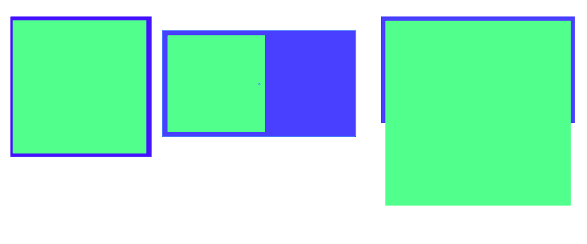
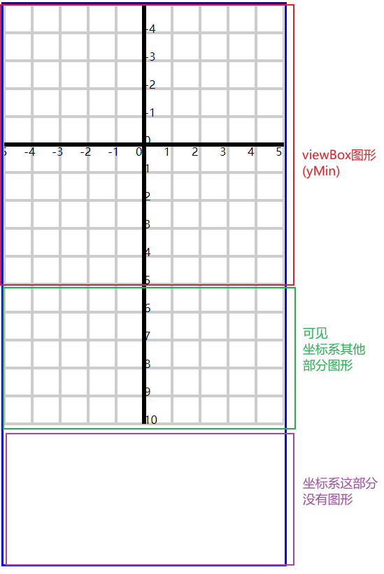
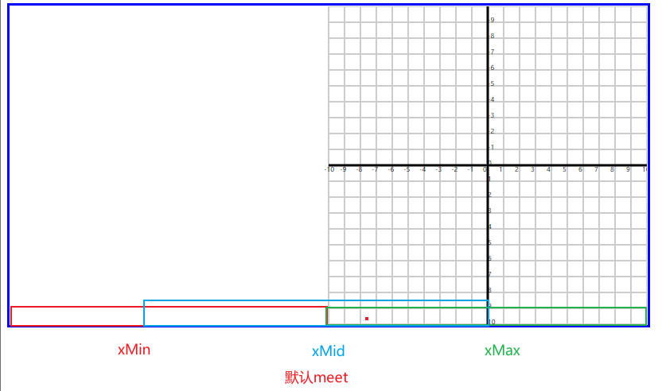

# preserveAspectRatio

## 解决的问题

+ 当 `viewBox` 宽高 与 `svg` 宽高不一致时，默认会进行一个等比例缩放

+ 我们之前都是让 `viewBox` 与 `svg` 的宽高比相同（人为控制）

+ 当 `svg` 宽高比，与 `viewBox` 宽高比不同时，图形又需要按照 `viewbox` 宽高比缩放

  ```
  假设：
    viewBox.width=100 viewBox.height=100  比例1:1（实际开发中viewBox图形区域的宽高比不一定是1:1）

    情况一：
    svg.width=200 svg.height=200  比例1:1
    此时正常放缩

    情况二：
    svg.width=200 svg.height=400  比例1:2  viewBox图形必须按照1:1放大
    此时viewbox放缩后会有两种宽高
      200*200
      400*400
  ```

  

+ 这个时候，是按照小的缩放，还是按照大的缩放？缩放后会有什么效果，又如何控制位置？

  + 就由 `preserveAspectRatio` 属性控制

## preserveAspectRatio作用

+ 保持(宽高)方面比例

## preserveAspectRatio 属性

+ `preserveAspectRatio ="align meetOrSlice"`

  + align 就是图形在窗口中的位置xMin xMid xMax yMin yMid yMax

    + 这部分值一共有上述9个组合 xMinYMin xMidYMin xMaxYMin xMinYMid .....
    + 此时注意：只会存在*一个方向*的位置关系 只会有一个方向生效。要么左中右，要么上中下

      ```html
      <svg
      viewBox="-50 -50 100 100" id="svg"
      width="400" height="800" style="padding: 1px; border: solid #00f"
      preserveAspectRatio="xMaxYMin meet"
      ></svg>
      ```

      

  + meetOrSlice 就是图形放缩时参考的svg.宽高数值 参考大的，还是参考小的？

    + `meet` （默认），viewBox图形会按照小的数值放缩，此时窗口区域就会多出一部分。这一部分可以显示viewBox没有包含到那部分坐标系内容（可见的） `preserveAspectRatio="xMaxYMin meet"`

    + `slice` ，viewBox图形会按照大的数值放缩。此时窗口过小，装不下图形。所以需要在viewBox图形中切一部分在窗口中展示 `preserveAspectRatio="xMaxYMin slice"`

+ 还有一种情况，就是不按照等比例缩放

  + 设置 `preserveAspectRatio="none"`

    ```html
    <svg
      viewBox="-100 -100 200 200" id="svg"
      width="800" height="400" style="padding: 1px; border: solid #00f"
      preserveAspectRatio="xMaxYMax"
    ></svg>
    ```

  + 就将viewBox图形按照现有的svg宽高比例拉伸

  
