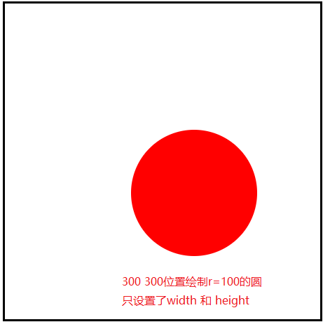
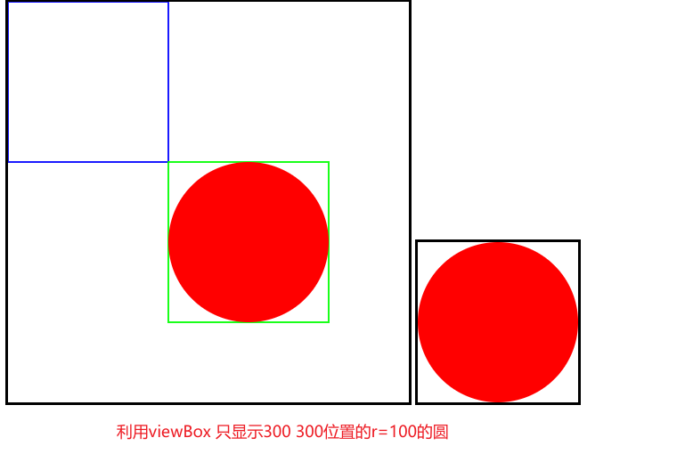

# viewBox

## 概述

+ 如果只设置了 `width` 和 `height` ，没有设置 `viewbox` ， 则 `viewbox` 默认为 `0 0 width height`

+ 一旦设置了 `viewbox`，则svg会充满窗口
+ 一般都会 `viewBox` 配合 `width` 和 `height`

## viewBox属性

+ `viewBox="x y width height"`

+ 指定一个视口的大小和位置，用来展示坐标系中指定的部分

  + `x` `y` 设置视口的起始位置
  + `width` `height` 设置视口的区域

  ```html
  <svg id="svg" width="500" height="500"  style="border:solid #000;">
    <circle cx="300" cy="300" r="100" fill="red"/>
  </svg>
  ```

  

  ```html
  <svg id="svg" width="200" height="200"
    viewBox="200 200 200 200" style="border:solid #000;">
    <circle cx="300" cy="300" r="100" fill="red"/>
  </svg>
  ```

  

### viewBox属性的 width 和 height

+ 确定最终图形展示的大小

  + 首先，使用 `viewBox` 确定了要展示图形的部分（位置）
  + 接下来就可以使用 `width` 和 `height` 设置展示图形的大小
  + 如果 `width` 和 `height` 的区域比 `viewBox` 区域大， 就会等比例放大
  + 否则会等比例缩小

  ```html
  <svg id="svg" width="500" height="500"
      viewBox="200 200 200 200" style="border: solid #000">
    <circle cx="300" cy="300" r="100" fill="red" />
  </svg>
  ```

  
