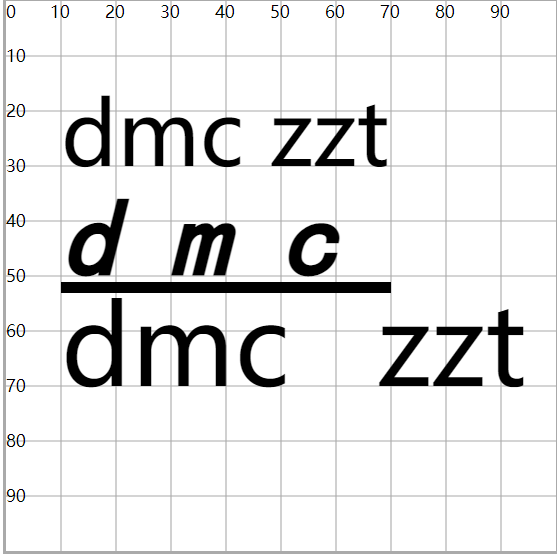
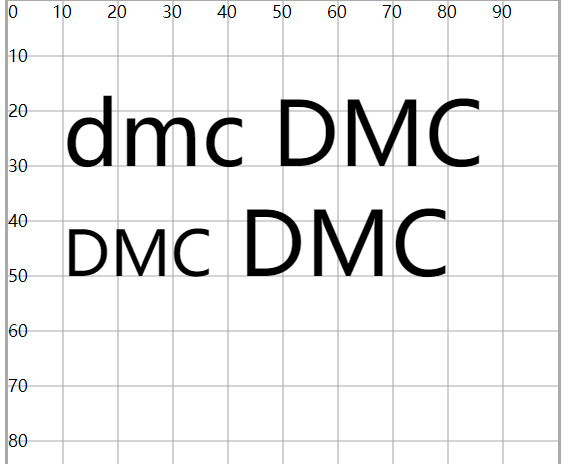
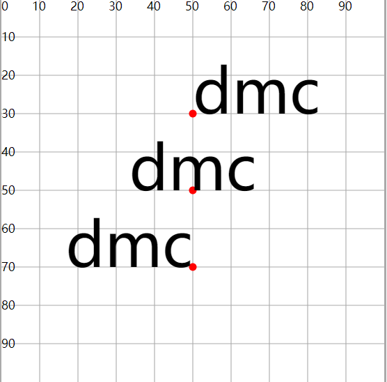
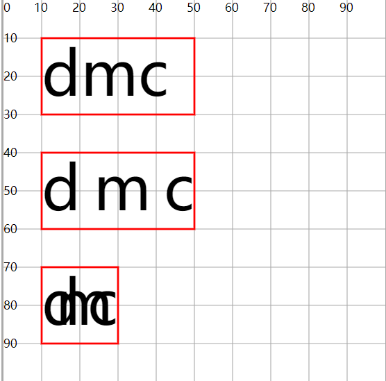

# 文本属性

## 属性

+ fill ： 设置字体颜色
+ font-size : 设置文字大小
+ font-family ： 设置字体
+ font-style ： 设置斜体
+ font-weight ： 设置粗体
+ text-decoration ： 设置文本装饰 下划线，上划线，删除线
+ letter-spacing : 设置每一个字母之间的距离
+ word-spacing ： 设置每一个单词之间的距离

  ```html
  <text x="10"  y="30" >dmc zzt</text>

  <text x="10"  y="50"
    font-size="20"
    font-family="楷体"
    font-style="italic"
    font-weight="bold"
    text-decoration="underline"
    letter-spacing="10"
    word-spacing="10">dmc</text>


  <text x="10"  y="70"
    font-size="20"
    word-spacing="10">dmc zzt</text>
  ```

  

+ font-variant ： 设置文字变体 ， 简单而言就是转大写，但确实小型的大写字母

  ```html
  <text x="10"  y="30" >dmc DMC</text>

  <text x="10"  y="50" font-variant="small-caps" >dmc DMC</text>
  ```

  

+ text-anchor ： 设置文本锚点， 基于x和y坐标位置

  + start 以x和y坐标为开始位置
  + middle 以x和y坐标为中间位置
  + end 以x和y坐标为结束位置

  ```html
  <circle cx="50" cy="30" r="1" fill="#f00"/>
  <circle cx="50" cy="50" r="1" fill="#f00"/>
  <circle cx="50" cy="70" r="1" fill="#f00"/>
  <text x="50"  y="30" text-anchor="start">dmc</text>
  <text x="50"  y="50" text-anchor="middle">dmc</text>
  <text x="50"  y="70" text-anchor="end">dmc</text>
  ```

  

+ textLength : 设置文本书写的空间的长度

  + 文本长度>空间长度，压缩文字。反之发散文字

  ```html
  <rect x="10" y="10" width="40" height="20" fill="none" stroke="#f00" stroke-width=".5"/>
  <rect x="10" y="40" width="40" height="20" fill="none" stroke="#f00" stroke-width=".5"/>
  <rect x="10" y="70" width="20" height="20" fill="none" stroke="#f00" stroke-width=".5"/>
  <text x="10"  y="25"  >dmc</text>
  <text x="10"  y="55" textLength="40" >dmc</text>
  <text x="10"  y="85" textLength="20" >dmc</text>
  ```

  
