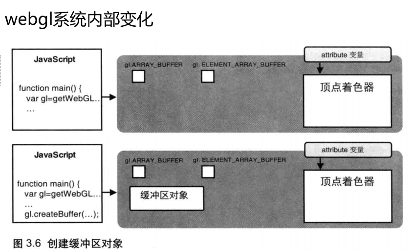

# 创建 + 删除缓冲区对象

## 创建缓冲区对象

+ `gl.createBuffer()` 创建缓冲区对象

  + 参数 无

  + 返回值

    + 非 `null` 新创建的缓冲区对象
    + `null` 创建缓冲区对象失败

  

+ 错误 无

  ```js
  const vertexBuffer=gl.createBuffer();
  ```

## 删除缓冲区对象

+ `gl.deleteBuffer(buffer)` 删除参数 `buffer` 表示的缓冲区对象

  + 参数

    + `buffer` 带删除的缓冲区对象

  + 返回值 无

+ 错误 无
