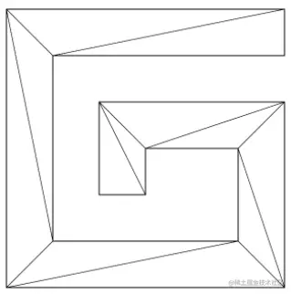
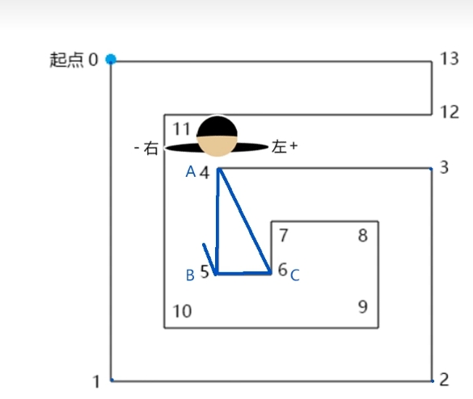
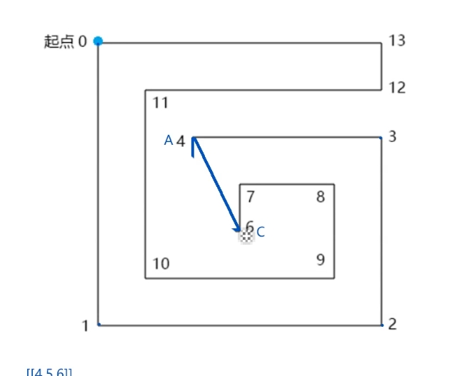

# 图形转面

## 概述

+ 在three.js 里有一个图形几何体 `ShapeGeometry` ，可以把图形变成面

  

## 原理

+ 使用的方法叫做“砍角”
+ 其原理就是从起点将多边形中符合特定条件的角逐个砍掉，然后保存到一个集合里，直到把多边形砍得只剩下一个三角形为止

## 砍角示例

+ 示例

  

+ 逆时针绘图的路径G

+ 求：将其变成下方网格的方法

  

## 步骤

+ 步骤1 寻找满足以下条件的▲ABC：

  + ▲ABC的顶点索引位置连续，如012,123、234
  + 点C在向量AB的正开半平面里，可以理解为你站在A点，面朝B点，点C要在你的左手边

    

  + ▲ABC中没有包含路径G 中的其它顶点

+ 步骤2 当找到▲ABC 后，就将点B从路径的顶点集合中删掉，然后继续往后找

  

+ 步骤3 当路径的定点集合只剩下3个点时，就结束
+ 步骤4 由所有满足条件的▲ABC构成的集合就是我们要求的独立三角形集合

