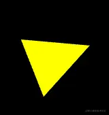

# 旋转

## 方式1 在着色器中旋转

+ 直接在着色器里写旋转公式

  + radians(float degree) 将角度转弧度
  + sin(float angle) 正弦
  + cos(float angle) 余弦

  ```html
  <script id="vertexShader" type="x-shader/x-vertex">
    attribute vec4 a_Position;
    float angle=radians(80.0);
    float sinB=sin(angle);
    float cosB=cos(angle);
    void main(){
        gl_Position.x=a_Position.x*cosB-a_Position.y*sinB;
        gl_Position.y=a_Position.y*cosB+a_Position.x*sinB;
        gl_Position.z=a_Position.z;
        gl_Position.w=1.0;
    }
  </script>
  ```

## 方式2 用js旋转图形

+ 将顶点着色器里的正弦值和余弦值暴露给js，便可以用js旋转图形了

  ```html
  <script id="vertexShader" type="x-shader/x-vertex">
    attribute vec4 a_Position;
    uniform float u_SinB;
    uniform float u_CosB;
    void main(){
        gl_Position.x=a_Position.x*u_CosB-a_Position.y*u_SinB;
        gl_Position.y=a_Position.y*u_CosB+a_Position.x*u_SinB;
        gl_Position.z=a_Position.z;
        gl_Position.w=1.0;
    }
  </script>
  ```

+ 在js 中修改uniform 变量

  ```js
  const u_SinB = gl.getUniformLocation(gl.program, 'u_SinB')
  const u_CosB = gl.getUniformLocation(gl.program, 'u_CosB')
  let angle = 0.3
  gl.uniform1f(u_SinB, Math.sin(angle))
  gl.uniform1f(u_CosB, Math.cos(angle))
  ```

+ 之后也可以让图形转起来

  ```js
  !(function ani() {
      angle += 0.01
      gl.uniform1f(u_SinB, Math.sin(angle))
      gl.uniform1f(u_CosB, Math.cos(angle))
      gl.clear(gl.COLOR_BUFFER_BIT);
      gl.drawArrays(gl.TRIANGLES, 0, 3);
      requestAnimationFrame(ani)
  })()
  ```

  
