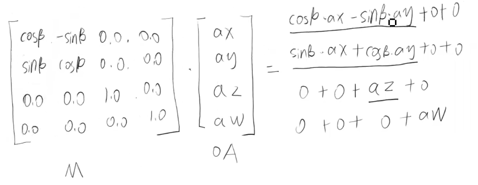

# 四维矩阵

## 概述

+ 四维矩阵在着色器里的应用原理和二维矩阵是一样的，只要理解了其运算原理就好

  

## 列主序 中的初始矩阵

+ 初始矩阵

  ```
  1.0, 0.0, 0.0, 0.0,
  0.0, 1.0, 0.0, 0.0,
  0.0, 0.0, 1.0, 0.0,
  0.0, 0.0, 0.0, 1.0
  ```

## 着色器

+ 着色器中书写四维矩阵

  ```html
  <script id="vertexShader" type="x-shader/x-vertex">
      attribute vec4 a_Position;
      float angle=radians(10.0);
      float cosB=cos(angle);
      float sinB=sin(angle);

      // 列主序
      mat4 m4=mat4(
        cosB, sinB,0.0,0.0,
        -sinB,cosB,0.0,0.0,
        0.0,  0.0, 1.0,0.0,
        0.0,  0.0, 0.0,1.0
      );
      void main(){
        gl_Position = m4*a_Position;
      }
  </script>
  ```

## JS中传递

+ 也可以用js向顶点着色器传递四维矩阵

  ```js
  const u_Matrix = gl.getUniformLocation(gl.program, 'u_Matrix')
  let angle = 0.1
  const [sinB, cosB] = [Math.sin(angle), Math.cos(angle)]
  const matrix = [
      cosB, sinB, 0.0, 0.0,
      -sinB, cosB, 0.0, 0.0,
      0.0, 0.0, 1.0, 0.0,
      0.0, 0.0, 0.0, 1.0
  ]
  gl.uniformMatrix4fv(u_Matrix, false, matrix)
  ```
