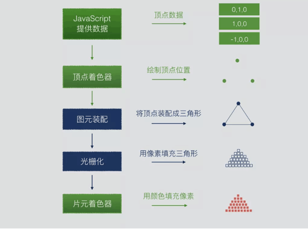
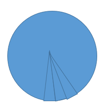
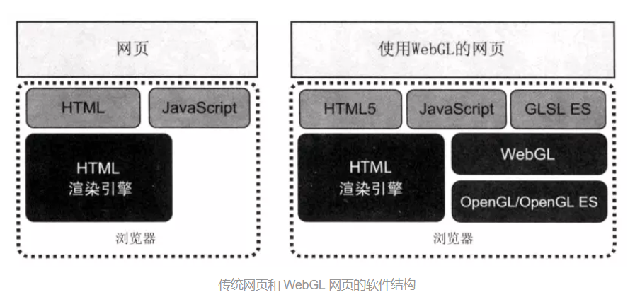

# webgl的工作原理

## 概述

+ webgl的工作方式和流水线类似，将一个绘图过程分成了多个步骤，当前步骤只对前一步骤打的结果进行处理，然后将处理后的结果传递给下一个步骤，最终渲染到2d屏幕上， 业界把这周渲染方式称之为*图形管线*或者*渲染管线*

## GPU渲染管线的主要处理过程

1. 首先进入顶点着色器阶段，利用GPU的并行计算优势对顶点逐个进行坐标变换
2. 然后进入图源装配阶段，将顶点按照图源类型组装成图形
3. 接下来到光栅化阶段，光栅化阶段将图形用不包含颜色信息的像素填充
4. 在之后进入片元着色器阶段，该阶段为像素着色器，并最终显示在屏幕上

  

## webgl可绘制的图元

1. 点
2. 线段
3. 三角形

  

## webgl页面与正常页面对比

+ 对比

  
