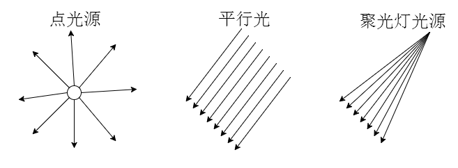

# 光源分类

## 概述

+ 环境光 `AmbientLight` 环境光是一种均匀的光照，它会均匀地照亮场景中的所有物体，不考虑光照源的位置和方向

+ 点光源 `PointLight` 点光源是一种位于特定位置的光源，它向所有方向发射光线，类似于灯泡

+ 聚光灯光源 `SpotLight` 照射出一个圆锥体，比如手电筒，舞台的灯光

+ 平行光 `DirectionalLight` 方向光是一种平行光源，它具有确定的方向和强度，类似于太阳光

+ 半球光 `HemisphereLight` 两种颜色的光，比如天空颜色、地面颜色相互叠加

+ 矩形平面光 `RectAreaLight` 类似窗户、LED 灯管等从一个面发光的效果

  
