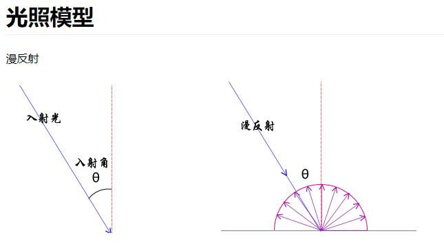

# 平行光与Mesh表面光线反射规律

## 概述

+ 平行光照射到网格模型Mesh表面，光线和模型表面构成一个入射角度，入射角度不同，对光照的反射能力不同

+ 光线照射到漫反射网格材质 `MeshLambertMaterial` 对应Mesh表面，Mesh表面对光线反射程度与入射角大小有关

  

  ```js
  // 对比不同入射角，mesh表面对光照的反射效果
  directionalLight.position.set(100, 0, 0);
  directionalLight.position.set(0, 100, 0);
  directionalLight.position.set(100, 100, 100);
  directionalLight.position.set(100, 60, 50);
  //directionalLight.target默认指向坐标原点
  ```
