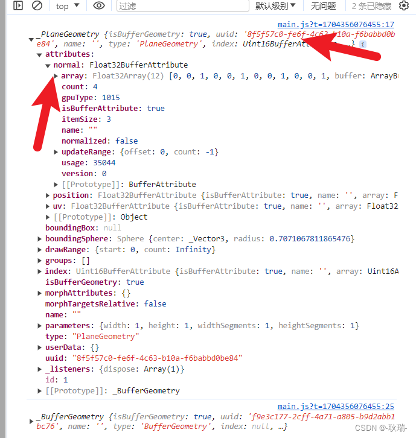
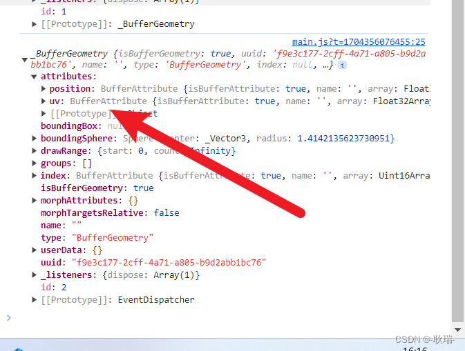

# 顶点法线数据 normal

## 概述

+ 顶点法线(法向量)数据 `geometry.attributes.normal`

+ Three.js中法线和数学中法线概念相似，只是定义的时候更灵活，会根据需要进行调整

## Three.js顶点法线 作用

+ 用来做光反射

  ```js
  // MeshBasicMaterial不受光照影响
  // 使用受光照影响的材质，几何体Geometry需要定义顶点法线数据
  const material = new THREE.MeshLambertMaterial({
      color: 0x0000ff,
      side: THREE.DoubleSide, //两面可见
  });

  // 如果更换成 MeshLambertMaterial 材质 则无法显示，因为受光照影响的材质，几何体BufferGeometry需要定义顶点法线数据
  ```

+ 通过 PlaneGeometry 创建的几何体 它是自带法向量

  

+ 自己创建的这个平面 它是没有的

  
