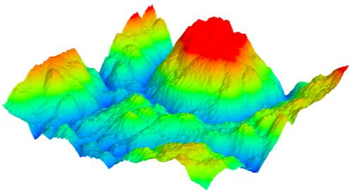

# 山脉地形高度可视化

## 概述

+ 一个山脉地形的高度可视化，具体说就是地形不同的高度设置不同的颜色值
+ 有多种方式，下面就举一个设置顶点颜色 `.attributes.color` 的例子

  

## 1. 山脉几何体y坐标范围

+ 1. 山脉几何体y坐标范围

  ```js
  loader.load("../地形.glb", function (gltf) {
    model.add(gltf.scene);
    const mesh = gltf.scene.children[0];
    const pos = mesh.geometry.attributes.position;
    const count = pos.count;

    // 1. 计算模型y坐标高度差
    const yArr = [];//顶点所有y坐标，也就是地形高度
    for (let i = 0; i < count; i++) {
        yArr.push(pos.getY(i));//获取顶点y坐标，也就是地形高度
    }
    yArr.sort();//数组元素排序，从小到大
    const miny = yArr[0];//y最小值
    const maxy = yArr[yArr.length - 1];//y最大值
    const height = maxy - miny; //山脉整体高度
  })
  ```

## 2.根据山脉顶点高度设置渐变颜色

+ 借助颜色对象的颜色插值方法 `.lerp()` ,计算山脉不同高度位置点的颜色

  ```js
  // 2. 计算每个顶点的颜色值
  const colorsArr = [];
  const c1 = new THREE.Color(0x0000ff);//山谷颜色
  const c2 = new THREE.Color(0xff0000);//山顶颜色
  for (let i = 0; i < count; i++) {
    //当前高度和整体高度比值
    const percent = (pos.getY(i) - miny) / height;
    const c = c1.clone().lerp(c2, percent);//颜色插值计算
    colorsArr.push(c.r, c.g, c.b);
  }
  const colors = new Float32Array(colorsArr);
  // 设置几何体attributes属性的颜色color属性
  mesh.geometry.attributes.color = new THREE.BufferAttribute(colors, 3);
  ```

## Mesh渲染山脉顶点颜色

+ Mesh渲染山脉顶点颜色

  ```js
  // 3. 设置材质，使用顶点颜色渲染
  mesh.material = new THREE.MeshLambertMaterial({
    vertexColors:true,
  });
  ```
