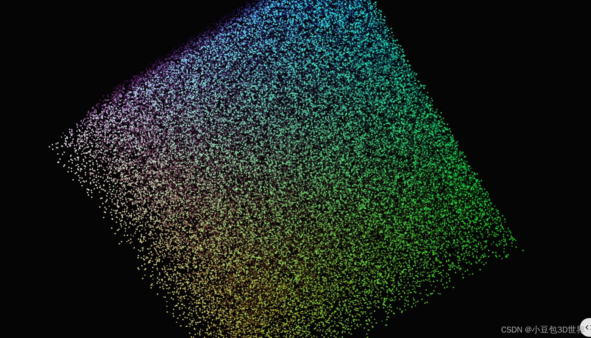

# PointsMaterial

## 概述

+ THREE.PointsMaterial 是 Three.js 中用于渲染点云（point clouds）或大量独立点的一种材质类型
+ 这种材质主要用于渲染大量点对象，每个点都可以有自己的颜色、大小和其他属性

+ THREE.PointsMaterial 非常适合用于渲染大规模的点云数据，如模拟星系、粒子系统或密集的点阵
+ 通过合理的配置，可以实现高性能且视觉效果良好的点云渲染

  

## 总结

+ THREE.PointsMaterial 是 Three.js 中用于渲染大量点对象的一种材质类型
+ 通过调整其属性，可以实现不同的视觉效果。以下是一些关键点：

  + 颜色：可以为每个点指定固定颜色，也可以使用顶点颜色
  + 大小：可以通过 size 属性控制点的大小，还可以通过 sizeAttenuation 属性启用大小衰减
  + 透明度：可以通过 transparent 和 opacity 属性控制点的透明度
  + 贴图：可以使用颜色贴图和透明度贴图来控制每个点的颜色和透明度
  + 自定义着色器：可以通过自定义顶点着色器和片段着色器来实现更复杂的渲染效果

## 示例

+ 使用 THREE.PointsMaterial 创建一个点云

  ```js
  // 创建点云几何体
  const count = 10000; // 点的数量
  const positions = new Float32Array(count * 3); // 每个点有 x, y, z 三个坐标
  for (let i = 0; i < count * 3; i++) {
    positions[i] = (Math.random() - 0.5) * 10; // 随机分布的点
  }

  const geometry = new THREE.BufferGeometry();
  const attribute = new THREE.Float32BufferAttribute(positions, 3);
  geometry.setAttribute('position', attribute);

  // 创建 PointsMaterial
  const material = new THREE.PointsMaterial({
    color: 0xff0000, // 红色
    size: 0.05, // 点的大小
    sizeAttenuation: true, // 启用大小衰减
    transparent: true, // 启用透明
    opacity: 0.5 // 透明度
  });

  // 创建点对象
  const points = new THREE.Points(geometry, material);
  scene.add(points);
  ```
