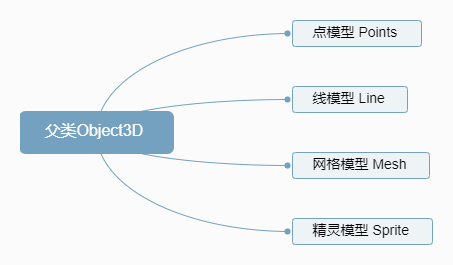
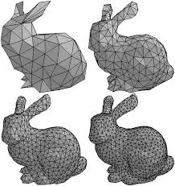

# 基础

## 概述

+ 点模型Points、线模型Line、网格网格模型Mesh等模型对象的父类都是Object3D
+ 如果想对这些模型进行旋转、缩放、平移等操作，如何实现，可以查询Threejs文档Object3D对相关属性和方法的介绍

  

## Mesh模型

+ 我们都知道，计算机的世界里，一条弧线是由有限个点构成的有限条线段连接得到的。线段很多时，看起来就是一条平滑的弧线了。
+ 计算机中的三维模型也是类似的，普遍的做法是用三角形组成的网格来描述，我们把这种模型称之为Mesh模型

  + 随着三角形数量的增加，它的表面越来越平滑/准确

  

## 构造器

+ `Mesh( geometry : BufferGeometry, material : Material )`

  + `geometry` 形状
  + `material` 材质

## 实际使用

+ 示例

  ```js
  //创建一个长方体几何对象Geometry
  const geometry = new BoxGeometry(100, 100, 100);

  //创建一个材质对象Material
  const material = new MeshBasicMaterial({
    color: 0xff0000,//0xff0000设置材质颜色为红色
  });

  // 两个参数分别为几何体geometry、材质material
  const mesh = new Mesh(geometry, material); //网格模型对象Mesh

  //设置网格模型在三维空间中的位置坐标，默认是坐标原点
  mesh.position.set(0, 10, 0);

  // 把网格模型mesh添加到三维场景scene中
  scene.add(mesh);
  ```

## 构造函数

+ `new THREE.Mesh(geometry, material)` 接受两个参数

  + geometry：可以是任何继承自 T`HREE.Geometry` 或 `THREE.BufferGeometry` 的几何体类，例如 `THREE.BoxGeometry`, `THREE.SphereGeometry` 等
  + material：可以是任何继承自 `THREE.Material` 的材质类，例如 `THREE.MeshBasicMaterial` ,  `THREE.MeshStandardMaterial` 等。你也可以传入一个材质数组，这样每个几何体的面将会按照顺序使用数组中的材质

  ```js
  // 创建一个带有红色漫反射材质的基本立方体网格
  const geometry = new THREE.BoxGeometry(1, 1, 1);
  const material = new THREE.MeshBasicMaterial({ color: 0xff0000 });
  const cube = new THREE.Mesh(geometry, material);
  scene.add(cube);
  ```
