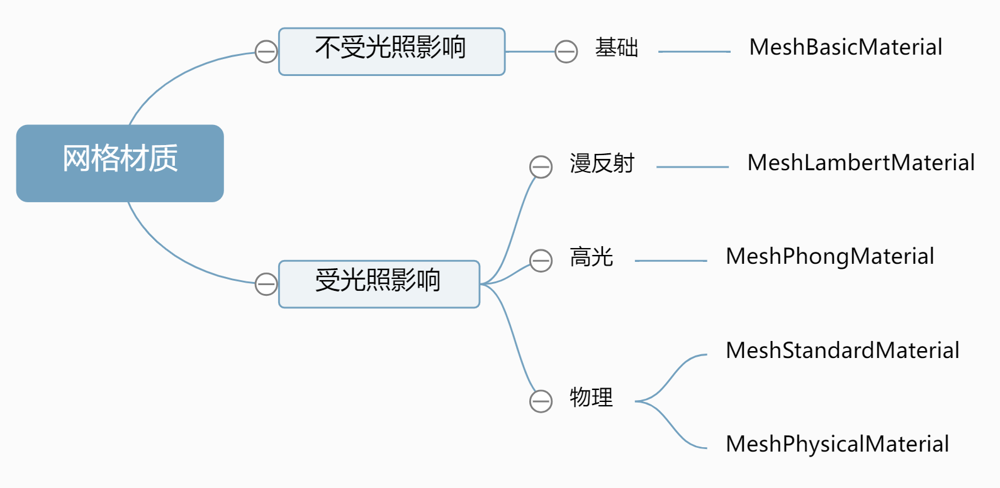
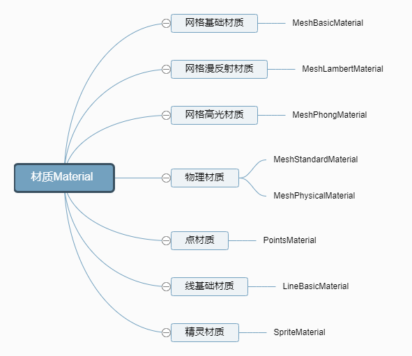

# 材质分类

## 种类

+ `MeshBasicMaterial` 为几何体赋予一种简单的颜色，或者显示几何体的线框
+ ``MeshDepthMaterial`` 根据网格到相机的距离，该材质决定如何给网格染色
+ `MeshNormalMaterial` 根据物体表面的法向量计算颜色 五彩缤纷的材质
+ `MeshFaceMaterial` 这是一种容器，可以在该容器中为物体的各个表面上设置不同的颜色
+ `MeshLambertMaterial` 考虑光照的影响，可以创建颜色暗淡，不光亮的物体
+ `MeshPhongMaterial` 考虑光照的影响，可以创建光亮的物体
+ `ShaderMaterial` 使用自定义的着色器程序，直接控制顶点的放置方式，以及像素的着色方式

+ `LineBasicMaterial` 可以用于 `THREE.Line` 几何体，从而创建着色的直线
+ `LineDashedMaterial` 类似与基础材质，但可以创建虚线效果

## 概述

+ 网格材质

  + 不受光照影响

    + 基础 `BasicMaterial`

  + 受光照影响

    + 漫反射 `MeshLambertMaterial`
    + 高光 `MeshPhongMaterial`
    + 物理 `MeshStandardMaterial` 和 `MeshPhysicalMaterial`

  
  

## 渲染占用资源和表现能力

+ 整体上来看，就是渲染表现能力越强，占用的计算机硬件资源更多

+ 占用渲染资源 `MeshBasicMaterial` < `MeshLambertMaterial` < `MeshPhongMaterial` < `MeshStandardMaterial` < `MeshPhysicalMaterial`

+ 渲染表现能力 `MeshBasicMaterial` < `MeshLambertMaterial` < `MeshPhongMaterial` < `MeshStandardMaterial` < `MeshPhysicalMaterial`
